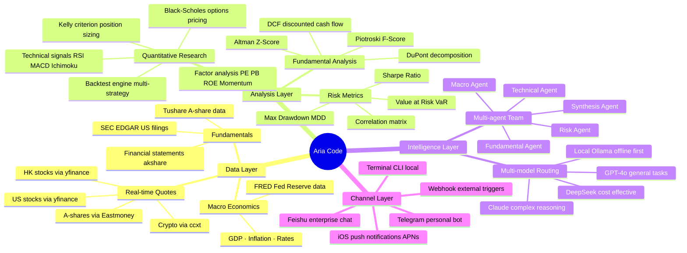

<p align="center">
  <picture>
    <source media="(prefers-color-scheme: dark)" srcset="docs/assets/logo-dark.png" width="100">
    
  </picture>
</p>

<p align="center">
  
  <a href="./README_CN.md"></a>
  
</p>

<p align="center">
  
  
  
  
  
</p>

<h1 align="center">Aria Code</h1>

<p align="center">
  <b>AI-powered financial terminal for the command line</b><br>
  <sub>Runs fully offline · Connects to Feishu & Telegram · Built for investors & quant researchers</sub>
</p>

<p align="center">
  <a href="#-quick-start">Quick Start</a> ·
  <a href="#-feishu-integration">Feishu</a> ·
  <a href="#-telegram-integration">Telegram</a> ·
  <a href="#-commands-reference">Commands</a> ·
  <a href="#-architecture">Architecture</a> ·
  <a href="./CONTRIBUTING.md">Contributing</a>
</p>

---

## What is Aria Code?

Aria Code is a **terminal-first AI financial agent** — think of it as Claude Code or Codex, but with deep finance domain knowledge built in. Ask it about stocks, portfolio optimization, quantitative strategies, or valuations, and it replies with real data, formulas, and analysis right in your terminal.

```
$ aria-code -p "Analyze NVDA momentum — give me RSI, MACD, and a short thesis"

  NVIDIA Corp (NVDA)  ── Technical Snapshot
  ──────────────────────────────────────────
  Price     $875.40    +2.3% today
  RSI (14)  68.4       Approaching overbought
  MACD      +4.2       Bullish crossover 3 days ago
  BB Width  0.18       Moderate volatility

  Signal:  ↑ BULLISH  (momentum intact, watch RSI > 70)
  Support: $842 / $810     Resistance: $900 / $925

  Thesis: AI infrastructure spending cycle still early. Data center
  revenue +427% YoY. Short-term pullback possible near $900 resistance,
  but structural uptrend intact. Risk: macro rate sensitivity.

  1.9s · yfinance · qwen2.5-coder:7b (local)
```

---

## 🧠 Thinking Framework

Aria Code processes every query through a **4-layer reasoning pipeline**:



---

## ✨ Features

| Capability | Details |
|-----------|---------|
| 🦙 **100% offline mode** | Powered by Ollama — no API key, no data leaves your machine |
| 📊 **Financial intelligence** | DCF / WACC / PE / Sharpe / Kelly / Black-Scholes + 30 more built-in formulas |
| 📈 **Live market data** | A-shares (Eastmoney) · US stocks (yfinance) · HK stocks · Crypto (ccxt) |
| 🔍 **Quant research** | `/backtest` `/signal` `/kelly` `/factor` `/portfolio` `/screen` |
| 🤖 **Auto LLM routing** | Ollama → Claude → OpenAI → DeepSeek → Gemini → DashScope |
| 🔌 **MCP protocol** | Connect any [Model Context Protocol](https://modelcontextprotocol.io) server |
| 💬 **Feishu / Telegram** | Ask Aria from any chat app, anytime |
| 📱 **iOS push alerts** | Real-time price alerts via APNs |
| 🌍 **Bilingual** | Responds in Chinese or English based on your prompt |
| 🏠 **Real estate analysis** | Property valuation, REIT screening, rental yield |

---

## 🚀 Quick Start

### Option 1: One-line install (macOS / Linux)

```bash
git clone https://github.com/Cinsoul/Aria-Code.git
cd aria-code
./install.sh
```

Add to PATH:

```bash
echo 'export PATH="$HOME/.local/bin:$PATH"' >> ~/.zshrc && source ~/.zshrc
```

### Option 2: Run directly

```bash
git clone https://github.com/Cinsoul/Aria-Code.git
cd aria-code
python3 -m venv .venv && source .venv/bin/activate
pip install -r requirements.txt
python3 aria_cli.py
```

### Step 1: Install Ollama (local LLM — offline, free)

```bash
# macOS / Linux
curl -fsSL https://ollama.ai/install.sh | sh

# Pull a model (choose one)
ollama pull qwen2.5-coder:7b    # Recommended — fast, great Chinese support (~4.7GB)
ollama pull deepseek-r1:7b      # Stronger reasoning for complex quant tasks
ollama pull llama3.2:3b         # Smallest, fastest (~2GB)
```

Run `aria-code` — it auto-detects Ollama.

### Step 2: Cloud API keys (all optional)

```bash
cp .env.example .env
# Edit .env and add any keys you have:
# ANTHROPIC_API_KEY=sk-ant-...
# OPENAI_API_KEY=sk-...
# DEEPSEEK_API_KEY=sk-...
```

All cloud providers are optional. Aria works fully offline with Ollama alone.

---

## 💬 Feishu Integration

Connect Aria to Feishu (Lark) and ask financial questions from any group or DM.

### How it works

```
Your Feishu message
       │
       ▼
  Feishu servers
       │
  ┌────┴────────────────────────────────────┐
  │  Mode A: Relay (recommended, 5 min)     │  Mode B: Own App (20 min)
  │  Aria Relay Server                       │  Feishu Open Platform App
  │  wss://relay.aria.ai                     │  Requires public IP or tunnel
  └────┬────────────────────────────────────┘
       │
       ▼
 aria_relay_client.py  (your machine)
       │
       ▼
 aria_cli.py → LLM → response sent back
```

---

### Mode A: Relay (Recommended — no public IP required)

> The simplest setup. The Aria relay server handles Feishu message forwarding; you only run a lightweight client locally.

**Step 1 — Generate your client ID**

```bash
python3 setup_wizard.py
# Select "Feishu relay mode"
# Output: ✅ Your Client ID: ARIA-xxxxxxxx-xxxx
```

**Step 2 — Bind in Feishu**

Send this message to the **Aria Bot** in Feishu (DM or group):

```
/bind ARIA-xxxxxxxx-xxxx
```

The bot replies with "Binding successful" — your machine is now linked.

**Step 3 — Configure**

```bash
cp .env.daemon.template ~/.aria/.env
# Edit ~/.aria/.env:
```

```env
ARIA_RELAY_URL=wss://relay.aria.ai
ARIA_RELAY_CLIENT_ID=ARIA-xxxxxxxx-xxxx    # from Step 1
ARIA_RELAY_MODE=relay
ARIA_CODE_DIR=~/aria-code
ARIA_API_BASE=http://localhost:8000
```

**Step 4 — Start**

```bash
# Foreground (for testing)
python3 aria_relay_client.py

# Background daemon (recommended)
python3 aria_daemon.py start
```

Now @mention the Bot in any Feishu group, or DM it:

```
@Aria What's the latest on NVDA?
@Aria /screen PE<15 ROE>20 market_cap>50B
```

---

### Mode B: Own Feishu App (Full bidirectional, slash commands)

> Best for teams and enterprise. Supports slash commands, proactive pushes, and card interactions.

**Step 1 — Create a Feishu app**

1. Open [Feishu Open Platform](https://open.feishu.cn/app) → "Create custom app"
2. Go to **Credentials** → copy **App ID** and **App Secret**
3. Go to **Event Subscriptions** → set request URL: `https://yourdomain.com/api/v1/feishu/webhook`
4. Subscribe to event: `im.message.receive_v1`
5. Go to **Permissions** → enable: `im:message` (read/write messages)
6. Publish the app

**Step 2 — Expose locally (if no public IP)**

```bash
# Using ngrok (free tier)
ngrok http 8000
# Copy the https://xxx.ngrok.io URL into Feishu event subscriptions
```

**Step 3 — Configure**

```bash
cp .env.daemon.template ~/.aria/.env
```

```env
FEISHU_APP_ID=cli_xxxxxxxxxxxxxxxxx
FEISHU_APP_SECRET=xxxxxxxxxxxxxxxxxxxxxxxxxxxxxxxx
FEISHU_ENCRYPT_KEY=              # Optional, recommended for production
FEISHU_DEFAULT_CHAT_ID=oc_xxx    # Default push target group Chat ID

ARIA_RELAY_MODE=own_app
ARIA_CODE_DIR=~/aria-code
ARIA_API_BASE=http://localhost:8000
```

**Step 4 — Start**

```bash
python3 aria_daemon.py start
# or
python3 aria_feishu_bot.py
```

**Available Bot commands in Feishu:**

```
/price 600519          → Moutai real-time quote
/price AAPL            → Apple quote
/brief NVDA            → AI fundamental brief
/screen PE<20 ROE>15   → Stock screener
/backtest momentum SPY → Strategy backtest
/portfolio AAPL MSFT GOOGL → Portfolio analysis
/help                  → All commands
```

---

## 📱 Telegram Integration

Get Aria in your Telegram — personal DM or group chat.

### How it works

```
Telegram App (your phone)
       │  your message
       ▼
Telegram Bot API  (api.telegram.org)
       │  polling / webhook
       ▼
aria_telegram_bot.py  (your machine)
       │
       ▼
aria_cli.py → LLM → response
       │
       ▼
Telegram Bot API → back to your phone
```

---

### Step 1: Create your Telegram Bot

1. Open Telegram, search for **@BotFather**
2. Send `/newbot`
3. Choose a display name (e.g. `Aria Financial`)
4. Choose a username — must end in `bot` (e.g. `aria_finance_bot`)
5. BotFather gives you a **Bot Token**: `1234567890:ABCDEFGxxxxxxxxxxxxxx`

### Step 2: Get your Chat ID

**Method 1 (easiest):** Message **@userinfobot** on Telegram — it replies with your Chat ID instantly.

**Method 2:** Send any message to your new bot, then open:
```
https://api.telegram.org/bot<YOUR_TOKEN>/getUpdates
```
Find `"chat":{"id": 123456789}` in the JSON response.

### Step 3: Configure

```bash
cp .env.daemon.template ~/.aria/.env
# Edit ~/.aria/.env:
```

```env
# Telegram Bot
TELEGRAM_BOT_TOKEN=1234567890:ABCDEFGxxxxxxxxxxxxxx
TELEGRAM_ALLOWED_IDS=123456789          # Your Chat ID (comma-separate multiple)

# To also allow a group, add the group ID (negative number):
# TELEGRAM_ALLOWED_IDS=123456789,-987654321

ARIA_CODE_DIR=~/aria-code
ARIA_API_BASE=http://localhost:8000
```

> ⚠️ **Security:** `TELEGRAM_ALLOWED_IDS` restricts the bot to specific users. If left empty, **anyone** can use your bot. Always set this.

### Step 4: Start

```bash
# Foreground (testing)
python3 aria_telegram_bot.py

# Background daemon (recommended)
python3 aria_daemon.py start

# Auto-start on login (macOS)
python3 aria_daemon.py install    # registers launchd service
```

### Step 5: Use it

Send messages to your bot in Telegram:

```
/start                           → Welcome message + help

/price AAPL                      → Apple real-time quote
/price 600519                    → Moutai A-share quote
/price BTC/USDT                  → Bitcoin price

# Or just ask naturally:
"What's the RSI on NVDA?"
"Run a DCF on Apple with 10% growth and 8% WACC"
"Compare PE and ROE for BABA vs JD"
"Backtest momentum strategy on SPY for 2023"
"What is the Kelly criterion? Give me the formula."
```

---

### Check connection status

```bash
python3 aria_daemon.py status

# Example output:
# ✅ Telegram Bot       Online  (last message: 3 min ago)
# ✅ Feishu Relay       Online  (2 groups bound)
# ✅ Ollama             Online  qwen2.5-coder:7b
# ✅ Market Data        Online  Eastmoney / yfinance
# ⚠️  APNs              Not configured  (iOS push unavailable)
```

---

## ⚡ Commands Reference

### Market & Quotes

```bash
/quote AAPL MSFT TSLA              # Real-time multi-symbol quotes
/quote 000001 600519 300750        # A-share quotes
/quote BTC/USDT ETH/USDT           # Crypto prices
/news AAPL                         # Latest news
/regime                            # Market regime (bull / bear / neutral)
```

### Quantitative Research

```bash
/signal TSLA                       # Technical signals (RSI / MACD / Bollinger)
/backtest momentum SPY 2023-01-01 2024-12-31
/backtest ml 600519 300750 NVDA    # ML signal backtest (3-strategy comparison)
/kelly AAPL 0.6 2.0                # Kelly formula — position size recommendation
/factor PE PB ROE                  # Multi-factor analysis
/screen PE<15 ROE>20               # Stock screener with filters
/portfolio AAPL MSFT GOOGL         # Portfolio optimization
/dcf                               # DCF valuation template
```

### Analysis

```bash
/brief AAPL                        # AI one-minute fundamental brief
/compare BABA JD                   # Side-by-side company comparison
/macro                             # Macro dashboard (GDP / CPI / Fed rates)
/sector tech                       # Sector analysis
/realty Shanghai Pudong            # Real estate analysis
```

### System

```bash
/model                             # View / switch LLM
/provider                          # LLM provider status
/status                            # System health check
/tools                             # Enabled tools list
/export                            # Export conversation
/clear                             # Clear history
```

---

## 🏗️ Architecture

### System Overview

```
┌─────────────────────────────────────────────────────────────────┐
│                          Aria Code                              │
│                                                                 │
│  ┌──────────┐  ┌────────────┐  ┌──────────┐  ┌─────────────┐ │
│  │ Terminal │  │Feishu Bot  │  │ Telegram │  │   Webhook   │ │
│  │   CLI    │  │(relay/app) │  │   Bot    │  │  External   │ │
│  └────┬─────┘  └─────┬──────┘  └────┬─────┘  └──────┬──────┘ │
│       └───────────────┴──────────────┴────────────────┘        │
│                               │                                 │
│                     ┌─────────▼──────────┐                     │
│                     │   aria_daemon.py    │                     │
│                     │  Message router     │                     │
│                     │  Job scheduler      │                     │
│                     └─────────┬──────────┘                     │
│                               │                                 │
│              ┌────────────────┼────────────────┐               │
│              │                │                │               │
│   ┌──────────▼───┐  ┌─────────▼───┐  ┌────────▼──────┐       │
│   │  LLM Router  │  │  Tool Exec  │  │  Data Layer   │       │
│   │  Ollama/API  │  │  bash/file  │  │  quotes/filings│      │
│   └──────────────┘  └─────────────┘  └───────────────┘       │
└─────────────────────────────────────────────────────────────────┘
```

### File Structure

```
aria-code/
├── aria_cli.py               # Main CLI + REPL entry point
├── aria_daemon.py            # Background daemon + scheduler
├── aria_feishu_bot.py        # Feishu Bot (own-app mode)
├── aria_relay_client.py      # Feishu relay client (local)
├── aria_relay_server.py      # Feishu relay server (self-hostable)
├── aria_telegram_bot.py      # Telegram Bot
├── market_data_client.py     # Unified market data interface
├── local_finance_tools.py    # Built-in financial calculators
├── financial_agents.py       # Multi-agent orchestration
│
├── providers/llm/            # LLM adapters
│   ├── anthropic.py          # Claude
│   ├── ollama.py             # Ollama (local)
│   ├── openai_compat.py      # OpenAI + compatible APIs
│   └── registry.py           # Auto-detection and routing
│
├── agents/
│   ├── financial/            # Fundamental / Technical / Macro / Risk / Synthesis
│   └── realty/               # 9 specialist real-estate agents
│
├── brokers/                  # Broker integrations
│   ├── cn/                   # Futu / Longbridge / Tiger / XTQuant
│   └── intl/                 # IBKR / Alpaca / Webull
│
├── datasources/sources/      # Data source adapters
│   ├── yfinance_source.py
│   ├── akshare_source.py
│   ├── fred_source.py        # Fed macro data
│   └── edgar_source.py       # SEC EDGAR
│
├── apps/cli/commands/        # Slash command modules (extracted)
│   ├── backtest_cmds.py
│   ├── market_cmds.py
│   ├── portfolio_cmds.py
│   └── broker_cmds.py
│
└── config/                   # Configuration templates
    ├── providers.example.yaml
    ├── mcp_servers.example.json
    └── datasources.example.yaml
```

---

## 📡 Market Data Sources

| Source | Coverage | API Key |
|--------|----------|---------|
| **Eastmoney** | A-share real-time, northbound flow, limit-up/down | None (free) |
| **akshare** | A-share history, financials, sector data | None (free) |
| **yfinance** | US, HK, global stocks, ETFs, FX | None (free) |
| **ccxt** | 100+ crypto exchanges | None (free tier) |
| **FRED** | Fed macro data — GDP, CPI, rates | Optional (free signup) |
| **SEC EDGAR** | US 10-K / 10-Q filings | None (free) |
| Tushare | A-share history + financials (more complete) | Optional (free token) |
| Finnhub | US real-time + earnings | Optional (free tier) |
| Alpha Vantage | US history + fundamentals | Optional (free tier) |

---

## 🔌 MCP Integration

Connect any [Model Context Protocol](https://modelcontextprotocol.io) server:

```bash
cp config/mcp_servers.example.json config/mcp_servers.json
```

```json
{
  "servers": [
    {
      "name": "filesystem",
      "command": "npx",
      "args": ["-y", "@modelcontextprotocol/server-filesystem", "/your/project"]
    },
    {
      "name": "brave-search",
      "command": "npx",
      "args": ["-y", "@modelcontextprotocol/server-brave-search"],
      "env": { "BRAVE_API_KEY": "your-key" }
    }
  ]
}
```

Inside Aria:

```bash
/mcp list      # List connected MCP servers
/mcp status    # Server health
```

---

## ⚙️ Configuration

Settings are stored in `~/.arthera/config.json`. Add a `.ariarc` file to any project for project-level overrides:

```json
{
  "model": "ollama/qwen2.5-coder:7b",
  "market": "us",
  "default_symbols": ["AAPL", "NVDA", "MSFT", "GOOGL"],
  "tools": ["read_file", "write_file", "bash", "web_search"],
  "commands": {
    "/morning": "Generate pre-market brief for {default_symbols}"
  }
}
```

### LLM Provider Priority

Aria automatically selects the first available provider:

```
Local Ollama  →  Anthropic Claude  →  OpenAI  →  DeepSeek  →  Gemini  →  DashScope
(offline first)  (best reasoning)   (general)  (cost-effective) (multimodal) (CN-optimized)
```

Force local mode: `ARIA_MODEL=ollama/qwen2.5-coder:7b`

---

## 🛠️ Requirements

- Python **3.10+**
- [Ollama](https://ollama.ai) (highly recommended for offline mode)
- RAM: 4GB+ (8GB+ for 7B models)
- macOS · Linux · Windows (WSL2)

```bash
pip install -r requirements.txt
```

Core dependencies: `rich` · `prompt_toolkit` · `yfinance` · `akshare` · `ccxt` · `pandas` · `numpy`

---

## 🤝 Contributing

Contributions welcome! See [CONTRIBUTING.md](./CONTRIBUTING.md).

```bash
git clone https://github.com/Cinsoul/Aria-Code.git
cd aria-code
python3 -m venv .venv && source .venv/bin/activate
pip install -r requirements.txt
pytest tests/ -v
```

Issues, PRs, and discussions are all welcome.

---

## Relation to Arthera

Aria Code is the open-source CLI component of [Arthera](https://arthera.finance) — an AI-powered quantitative investment platform. The full Arthera platform includes a web dashboard, desktop terminal, iOS app, and institutional quant engine.

Aria Code is designed to work as a **standalone tool** — it does not require the Arthera backend. All financial calculations run locally. Cloud features (real-time A-share data, ML predictions) are optional and can connect to your own self-hosted backend or the Arthera cloud service.

---

## License

MIT © 2025 Arthera Team — see [LICENSE](./LICENSE)

---

<p align="center">
  <a href="https://arthera.finance">Website</a> ·
  <a href="https://github.com/Cinsoul/Arthera">Full Platform</a> ·
  <a href="https://github.com/Cinsoul/Aria-Code/issues">Issues</a> ·
  <a href="https://github.com/Cinsoul/Aria-Code/discussions">Discussions</a>
</p>
