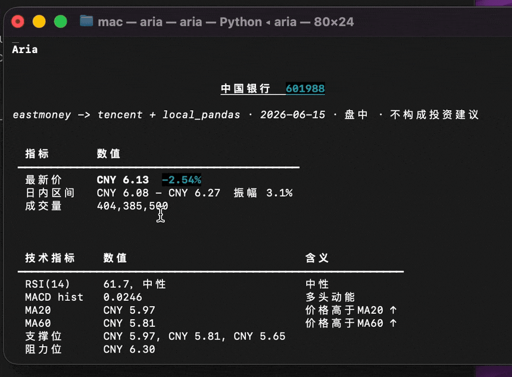
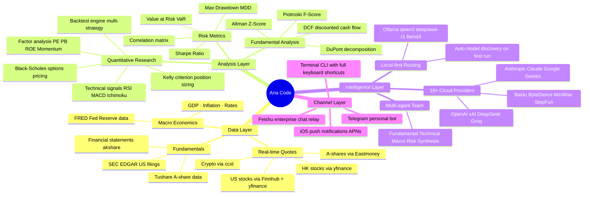

<p align="center">
  <picture>
    <source media="(prefers-color-scheme: dark)" srcset="docs/assets/logo-dark.svg" width="100">
    
  </picture>
</p>

<p align="center">
  <a href="./README_CN.md"></a>
  
</p>

<p align="center">
  
  
  
  
  
  
</p>

<h1 align="center">Aria Code</h1>

<p align="center">
  <b>AI-powered financial terminal for the command line</b><br>
  <sub>Runs fully offline · 19+ cloud providers · Auto language detection · Built for investors & quant researchers</sub>
</p>

<p align="center">
  <a href="#-quick-start">Quick Start</a> ·
  <a href="#-keyboard-shortcuts">Shortcuts</a> ·
  <a href="#-model-support">Models</a> ·
  <a href="#-commands-reference">Commands</a> ·
  <a href="#-feishu-integration">Feishu</a> ·
  <a href="#-telegram-integration">Telegram</a> ·
  <a href="#-architecture">Architecture</a>
</p>

<p align="center">
  
</p>

---

## What is Aria Code?

Aria Code is a **terminal-first AI financial agent** — think of it as Claude Code, but with deep finance domain knowledge and full offline capability. Ask it about stocks, portfolio optimization, quantitative strategies, or code, and it replies with real data, formulas, and analysis right in your terminal.

```
$ aria-code

  ▣ Aria Code  v4.0  local-first agent
  model      qwen2.5-coder:7b  local
  workspace  ~/my-portfolio
  mode       workspace-write · network on · local-only
  status     Ollama online · 3 models

  try  analyze AAPL  ·  /project load ./myapp  ·  /help

> analyze NVDA momentum — give me RSI, MACD, and a short thesis

  NVIDIA Corp (NVDA)  ── Technical Snapshot
  ─────────────────────────────────────────
  Price     $875.40    +2.3% today          (Finnhub real-time)
  RSI (14)  68.4       Approaching overbought
  MACD      +4.2       Bullish crossover 3 days ago
  BB Width  0.18       Moderate volatility

  Signal:  ↑ BULLISH  (momentum intact, watch RSI > 70)
  Support: $842 / $810     Resistance: $900 / $925

  Thesis: AI infrastructure spending cycle still early …

  1.9s · qwen2.5-coder:7b (local)
```

---

## ✨ What's New in v4.0

| Feature | Description |
|---------|-------------|
| ⌨️ **Keyboard shortcuts** | `Shift+Tab` cycle modes · `Alt+T` thinking · `Alt+P` model picker · `Ctrl+O` transcript · `Ctrl+T` tasks |
| `!` **Shell mode** | Type `! git status` to run shell commands, output auto-added to AI context |
| `@` **File autocomplete** | Type `@src/` to get instant file path completion anywhere in input |
| `/btw` **Side questions** | Ask quick questions without polluting conversation history |
| `/recap` **Session recap** | One-line summary on return · auto-shown after 3 min away |
| 🌍 **Auto language** | UI and responses auto-detect Chinese/English from OS locale on first run |
| 🤖 **19+ cloud providers** | Google Gemini · xAI Grok · Mistral · Cohere · Perplexity · Baidu ERNIE · ByteDance · MiniMax · StepFun · 01.AI + all originals |
| 📊 **Finnhub primary** | US stocks now routed to Finnhub first — faster, authoritative `dp` field for % change |
| 🔢 **All Ollama models** | Qwen3 · DeepSeek-R1 · Llama 3.x · Phi-4 · Gemma3 · Mistral families |

---

## 🧠 Intelligence Pipeline



---

## ✨ Core Features

| Capability | Details |
|-----------|---------|
| 🦙 **100% offline mode** | Powered by Ollama — no API key, no data leaves your machine |
| 📊 **Financial intelligence** | DCF / WACC / PE / Sharpe / Kelly / Black-Scholes + 30 more built-in formulas |
| 📈 **Live market data** | A-shares (Eastmoney) · US stocks (Finnhub) · HK · Crypto (ccxt) |
| 🔍 **Quant research** | `/backtest` `/signal` `/kelly` `/factor` `/portfolio` `/screen` `/corr` `/ptbt` |
| 🤖 **19+ cloud providers** | All major international + Chinese LLM APIs supported |
| 🔌 **MCP protocol** | Connect any [Model Context Protocol](https://modelcontextprotocol.io) server |
| ⌨️ **Rich keyboard UX** | Vim mode · `!` shell · `@` files · `Shift+Tab` modes · transcript viewer |
| 💬 **Feishu / Telegram** | Ask Aria from any chat app, anytime |
| 📱 **iOS push alerts** | Real-time price alerts via APNs |
| 🌍 **Auto bilingual** | OS language auto-detected on first run; output follows user's input language |
| 🏠 **Real estate** | Property valuation, REIT screening, rental yield, 70-city China housing |

---

## 🚀 Quick Start

### Option 1: One-line install (macOS / Linux)

```bash
git clone https://github.com/Cinsoul/Aria-Code.git
cd aria-code
./install.sh
```

Add to PATH:

```bash
echo 'export PATH="$HOME/.local/bin:$PATH"' >> ~/.zshrc && source ~/.zshrc
```

### Option 2: Run directly

```bash
git clone https://github.com/Cinsoul/Aria-Code.git
cd aria-code
python3 -m venv .venv && source .venv/bin/activate
pip install -r requirements.txt
python3 aria_cli.py
```

### Step 1: Install Ollama (local LLM — free, fully offline)

```bash
# macOS / Linux
curl -fsSL https://ollama.ai/install.sh | sh

# Pull a model (choose one — auto-detected on first run)
ollama pull qwen2.5-coder:7b    # Recommended — fast, great Chinese support (~4.7GB)
ollama pull qwen3:8b            # Latest Qwen, stronger reasoning
ollama pull deepseek-r1:7b      # Strong reasoning for complex quant tasks
ollama pull llama3.2:3b         # Smallest, fastest (~2GB)
ollama pull phi4-mini           # Microsoft Phi-4 mini, excellent code
```

Aria auto-discovers the best installed model on first run — no configuration needed.

### Step 2: Cloud API keys (all optional)

```bash
# Interactive setup wizard
python3 setup_wizard.py

# Or manually copy and edit
cp .env.example .env
```

The setup wizard now covers all 19 cloud providers including Google Gemini, xAI Grok, Mistral, Baidu ERNIE, ByteDance Doubao, and more.

---

## ⌨️ Keyboard Shortcuts

Aria Code has a full keyboard shortcut system powered by `prompt_toolkit`:

### General

| Shortcut | Action |
|----------|--------|
| `Shift+Tab` | Cycle permission modes: `read-only` → `workspace-write` → `full-access` |
| `Alt+T` | Toggle thinking mode on/off |
| `Alt+P` | Open model switcher (fills `/model` in prompt) |
| `Ctrl+O` | Toggle transcript viewer — shows all tool calls with timestamps |
| `Ctrl+T` | Toggle task list — live pending/in-progress/done indicator |
| `Ctrl+L` | Redraw terminal screen (fixes garbled display) |
| `Ctrl+C` | Cancel current response / clear input |
| `Ctrl+D` | Exit Aria |
| `Esc` | Interrupt streaming response |

### Input Modes

| Prefix | Mode | Example |
|--------|------|---------|
| `/` | Slash command with fuzzy autocomplete | `/backtest momentum SPY` |
| `!` | Shell mode — runs command, adds output to context | `! git diff HEAD~1` |
| `@` | File path autocomplete | `@src/components/` |
| `"""` | Multi-line input mode (end with `"""`) | For pasting code blocks |

### Bottom Toolbar (always visible)

```
qwen2.5-coder:7b · ~/my-project ⎇ main ✓3/5 · rw · local-only · /help · 1,240/16,384
│                    │           │      │       │    │
│                    │           │      │       │    └── context usage
│                    │           │      │       └── privacy status
│                    │           │      └── permission: ro/rw/full (color-coded)
│                    │           └── task progress
│                    └── git branch
└── current model
```

---

## 🤖 Model Support

### Local Models (via Ollama — offline, free)

| Model | Command | Size | Best For |
|-------|---------|------|----------|
| **qwen2.5-coder:7b** ⭐ | `ollama pull qwen2.5-coder:7b` | 4.7GB | Code + Chinese (recommended) |
| qwen3:8b | `ollama pull qwen3:8b` | 5.2GB | Latest Qwen, reasoning |
| qwen3:30b-a3b | `ollama pull qwen3:30b-a3b` | 17GB | High capability |
| deepseek-r1:7b | `ollama pull deepseek-r1:7b` | 4.7GB | Strong math/reasoning |
| deepseek-r1:1.5b | `ollama pull deepseek-r1:1.5b` | 1.1GB | Ultra-light reasoning |
| llama3.2:3b | `ollama pull llama3.2:3b` | 2GB | General, fastest |
| llama3.1:8b | `ollama pull llama3.1:8b` | 4.7GB | General purpose |
| mistral:7b | `ollama pull mistral:7b` | 4.1GB | European quality |
| phi4-mini | `ollama pull phi4-mini` | 2.5GB | Excellent code, small |
| gemma3:4b | `ollama pull gemma3:4b` | 3.3GB | Google, efficient |

Switch model anytime:

```bash
/model                    # Interactive picker with install status
/model qwen3:8b           # Direct switch
/model openai/gpt-4.5     # Cloud model
Alt+P                     # Keyboard shortcut
```

### Cloud Providers (19+ supported)

#### International

| Provider | Models | Env Var |
|----------|--------|---------|
| **Anthropic** | Claude Sonnet 4, Opus 4 | `ANTHROPIC_API_KEY` |
| **OpenAI** | GPT-4.5, o3, o4-mini | `OPENAI_API_KEY` |
| **DeepSeek** | deepseek-chat, deepseek-reasoner | `DEEPSEEK_API_KEY` |
| **Google Gemini** | gemini-2.0-flash, 2.5-pro | `GOOGLE_API_KEY` |
| **xAI Grok** | grok-3, grok-3-fast | `XAI_API_KEY` |
| **Groq** | llama-3.3-70b (fast inference) | `GROQ_API_KEY` |
| **Mistral** | mistral-large, codestral | `MISTRAL_API_KEY` |
| **Cohere** | command-r-plus | `COHERE_API_KEY` |
| **Perplexity** | sonar-pro (web search) | `PERPLEXITY_API_KEY` |
| **Together AI** | 100+ open-source models | `TOGETHER_API_KEY` |

#### Chinese Providers (国内)

| Provider | Models | Env Var |
|----------|--------|---------|
| **SiliconFlow 硅基流动** | Qwen/DeepSeek hosted | `SILICONFLOW_API_KEY` |
| **DashScope 阿里百炼** | qwen-max, qwen-turbo | `DASHSCOPE_API_KEY` |
| **Moonshot Kimi** | moonshot-v1-128k | `MOONSHOT_API_KEY` |
| **Zhipu GLM 智谱** | glm-4-plus | `ZHIPU_API_KEY` |
| **Baidu ERNIE 百度千帆** | ernie-4.5-turbo | `QIANFAN_ACCESS_KEY` |
| **ByteDance Doubao 豆包** | (endpoint-based) | `ARK_API_KEY` |
| **MiniMax** | MiniMax-Text-01 | `MINIMAX_API_KEY` |
| **StepFun 阶跃星辰** | step-2-16k | `STEPFUN_API_KEY` |
| **01.AI Yi 零一万物** | yi-large | `ONEAI_API_KEY` |

Use any provider:

```bash
/model anthropic/claude-sonnet-4-6
/model google/gemini-2.0-flash-exp
/model baidu/ernie-4.5-turbo-128k
/model moonshot/moonshot-v1-128k
/apikey       # Interactive wizard for all 19 providers
```

---

## ⚡ Commands Reference

### Market & Quotes

```bash
/quote AAPL MSFT TSLA              # Real-time multi-symbol quotes (Finnhub)
/quote 000001 600519 300750        # A-share quotes (Eastmoney)
/quote BTC/USDT ETH/USDT           # Crypto prices
/news AAPL                         # Latest financial news
/regime                            # Market regime (bull / bear / neutral)
/alert add AAPL gt 200             # Price alert
/alert list                        # View all alerts
```

### Quantitative Research

```bash
/signal TSLA                       # Technical signals (RSI / MACD / Bollinger)
/backtest momentum SPY 2023-01-01 2024-12-31
/backtest ml 600519 300750 NVDA    # ML signal backtest (3-strategy comparison)
/wf SPY momentum                   # Walk-forward backtest
/kelly AAPL 0.6 2.0                # Kelly formula — position size recommendation
/factor PE PB ROE                  # Multi-factor analysis
/screen PE<15 ROE>20               # Stock screener with filters
/portfolio AAPL MSFT GOOGL         # Portfolio optimization
/ptbt AAPL MSFT GOOG 0.4 0.3 0.3  # Portfolio backtest with weights
/corr AAPL MSFT TSLA SPY           # Correlation matrix
/ichimoku AAPL                     # Ichimoku cloud chart
/options AAPL calls 2025-01        # Options chain
/quality AAPL                      # Piotroski + Altman Z-score
```

### Analysis

```bash
/analyze AAPL                      # AI full analysis
/peer AAPL MSFT GOOGL META         # Peer comparison
/macro                             # Macro dashboard (GDP / CPI / Fed rates)
/macro cn                          # China macro data
/sector tech                       # Sector analysis
/realty Shanghai Pudong            # Real estate analysis
/feargreed                         # Crypto Fear & Greed Index
/funding BTC ETH                   # Perpetual funding rates
```

### Session & UI

```bash
/btw what was that function name?  # Side question — no history pollution
/recap                             # Session summary (turns + topics)
/clear                             # Clear conversation
/compact                           # Smart context compression
/history                           # Show recent conversation
/sessions                          # List saved sessions
/export md report.md               # Export conversation
/rename "NVDA Research"            # Name current session
```

### System

```bash
/model                             # View / switch LLM (interactive picker)
/apikey                            # API key wizard for all 19 providers
/config set ui_lang=zh             # Force Chinese UI
/config set ui_lang=en             # Force English UI
/thinking on                       # Enable extended thinking mode
/privacy status                    # Privacy settings
/tools                             # List all enabled tools
/skills                            # List skills
/mcp list                          # MCP server status
/doctor                            # Diagnose installation issues
/providers                         # All provider status
```

---

## 🌍 Language Auto-Detection

On first run, Aria reads your OS locale and sets the UI language automatically:

```bash
# Chinese system → Chinese UI + hints
LANG=zh_CN.UTF-8  →  本地优先智能体 · Ollama 在线 · 试试 分析 AAPL

# English system → English UI + hints
LANG=en_US.UTF-8  →  local-first agent · Ollama online · try analyze AAPL
```

AI **output language** always follows your input — ask in Chinese, get Chinese; ask in English, get English.

Override anytime:

```bash
/config set ui_lang=zh    # Force Chinese
/config set ui_lang=en    # Force English
/config set ui_lang=auto  # Back to OS auto-detect
```

---

## 💬 Feishu Integration

Connect Aria to Feishu (Lark) and ask financial questions from any group or DM.

### How it works

```
Your Feishu message
       │
       ▼
  Feishu servers
       │
  ┌────┴────────────────────────────────────┐
  │  Mode A: Relay (recommended, 5 min)     │  Mode B: Own App (20 min)
  │  Aria Relay Server                       │  Feishu Open Platform App
  │  wss://relay.aria.ai                     │  Requires public IP or tunnel
  └────┬────────────────────────────────────┘
       │
       ▼
 aria_relay_client.py  (your machine)
       │
       ▼
 aria_cli.py → LLM → response sent back
```

### Mode A: Relay (Recommended)

```bash
python3 setup_wizard.py
# Select "Feishu relay mode"
# Output: ✅ Your Client ID: ARIA-xxxxxxxx-xxxx
```

Send to the **Aria Bot** in Feishu:

```
/bind ARIA-xxxxxxxx-xxxx
```

Configure `~/.aria/.env`:

```env
ARIA_RELAY_URL=wss://relay.aria.ai
ARIA_RELAY_CLIENT_ID=ARIA-xxxxxxxx-xxxx
ARIA_RELAY_MODE=relay
ARIA_CODE_DIR=~/aria-code
```

Start:

```bash
python3 aria_daemon.py start
```

### Mode B: Own Feishu App

1. Open [Feishu Open Platform](https://open.feishu.cn/app) → Create custom app
2. Set event URL: `https://yourdomain.com/api/v1/feishu/webhook`
3. Subscribe to `im.message.receive_v1`

```env
FEISHU_APP_ID=cli_xxxxxxxxxxxxxxxxx
FEISHU_APP_SECRET=xxxxxxxxxxxxxxxxxxxxxxxxxxxxxxxx
ARIA_RELAY_MODE=own_app
```

---

## 📱 Telegram Integration

### Setup

1. Message **@BotFather** → `/newbot` → copy your **Bot Token**
2. Message **@userinfobot** → copy your **Chat ID**

Configure:

```env
TELEGRAM_BOT_TOKEN=1234567890:ABCDEFGxxxxxxxxxxxxxx
TELEGRAM_ALLOWED_IDS=123456789
ARIA_CODE_DIR=~/aria-code
```

Start:

```bash
python3 aria_daemon.py start
```

Use in Telegram:

```
/price AAPL                → Apple real-time quote
/price 600519              → Moutai A-share
/price BTC/USDT            → Bitcoin
Analyze NVDA momentum      → Full AI analysis
```

---

## 🏗️ Architecture

```
┌─────────────────────────────────────────────────────────────────┐
│                          Aria Code v4.0                         │
│                                                                 │
│  ┌──────────┐  ┌────────────┐  ┌──────────┐  ┌─────────────┐ │
│  │ Terminal │  │Feishu Bot  │  │ Telegram │  │   Webhook   │ │
│  │   CLI    │  │(relay/app) │  │   Bot    │  │  External   │ │
│  └────┬─────┘  └─────┬──────┘  └────┬─────┘  └──────┬──────┘ │
│       └───────────────┴──────────────┴────────────────┘        │
│                               │                                 │
│                     ┌─────────▼──────────┐                     │
│                     │   aria_daemon.py    │                     │
│                     │  Message router     │                     │
│                     └─────────┬──────────┘                     │
│                               │                                 │
│              ┌────────────────┼────────────────┐               │
│              │                │                │               │
│   ┌──────────▼───┐  ┌─────────▼───┐  ┌────────▼──────┐       │
│   │  LLM Router  │  │  Tool Exec  │  │  Data Layer   │       │
│   │19+ providers │  │  bash/file  │  │Finnhub/EastMny│       │
│   └──────────────┘  └─────────────┘  └───────────────┘       │
└─────────────────────────────────────────────────────────────────┘
```

### File Structure

```
aria-code/
├── aria_cli.py               # Main CLI + REPL (keyboard shortcuts, ! shell, @files)
├── aria_daemon.py            # Background daemon + scheduler
├── market_data_client.py     # Unified market data (Finnhub primary for US)
├── setup_wizard.py           # Bilingual setup wizard (19 providers)
│
├── apps/cli/
│   ├── i18n.py               # Language auto-detection + UI string translations
│   ├── commands/
│   │   └── model_cmds.py     # /model /apikey /providers (19 cloud providers)
│   ├── prompts/
│   │   └── coding.py         # Code generation prompts (end_date fix, akshare fallback)
│   └── tools/
│       └── market_tools.py   # Market data tools (Finnhub dp field)
│
├── ui/
│   ├── banner.py             # Bilingual banner (i18n aware)
│   └── completer.py          # Fuzzy autocomplete: / commands · @ files · ! history
│
├── providers/llm/            # LLM adapters (19+ cloud endpoints)
├── agents/financial/         # Fundamental / Technical / Macro / Risk / Synthesis
├── brokers/                  # CN (Futu/Longbridge/Tiger) + Intl (IBKR/Alpaca)
└── datasources/sources/      # yfinance · akshare · FRED · EDGAR · Finnhub
```

---

## 📡 Market Data Sources

| Source | Coverage | API Key |
|--------|----------|---------|
| **Finnhub** ⭐ | US real-time quotes (primary) + earnings | Optional free tier |
| **Eastmoney** | A-share real-time, northbound flow, limit-up/down | None (free) |
| **akshare** | A-share history, financials, sector data | None (free) |
| **yfinance** | US/HK/global stocks, ETFs, FX, history | None (free) |
| **ccxt** | 100+ crypto exchanges | None (free tier) |
| **FRED** | Fed macro — GDP, CPI, rates | Optional (free signup) |
| **SEC EDGAR** | US 10-K / 10-Q filings | None (free) |
| Alpha Vantage | US history + fundamentals | Optional (free tier) |
| Polygon | US market data (professional) | Optional (free tier) |
| Tushare | A-share complete data | Optional (free token) |

---

## 🔌 MCP Integration

Connect any [Model Context Protocol](https://modelcontextprotocol.io) server:

```json
{
  "servers": [
    {
      "name": "filesystem",
      "command": "npx",
      "args": ["-y", "@modelcontextprotocol/server-filesystem", "/your/project"]
    },
    {
      "name": "brave-search",
      "command": "npx",
      "args": ["-y", "@modelcontextprotocol/server-brave-search"],
      "env": { "BRAVE_API_KEY": "your-key" }
    }
  ]
}
```

```bash
/mcp list      # List connected MCP servers
/mcp status    # Server health
/mcp tools     # All available MCP tools
```

---

## ⚙️ Configuration

Settings are stored in `~/.arthera/config.json`. Add `.ariarc` to any project for project-level overrides:

```json
{
  "model": "qwen2.5-coder:7b",
  "ui_lang": "auto",
  "market": "us",
  "permission_mode": "workspace-write",
  "default_symbols": ["AAPL", "NVDA", "MSFT", "GOOGL"],
  "thinking": false
}
```

### LLM Provider Priority

Aria automatically selects the first available provider:

```
Local Ollama  →  Anthropic  →  OpenAI  →  DeepSeek  →  Google  →  xAI  →  Groq  →  …
(offline first)  (reasoning)   (general)  (cost-eff.)  (multi.)  (web)  (fast)
```

Force local mode: `ARIA_MODEL=ollama/qwen2.5-coder:7b`

---

## 🛠️ Requirements

- Python **3.10+**
- [Ollama](https://ollama.ai) (highly recommended for offline mode)
- RAM: 4GB+ (8GB+ for 7B models)
- macOS · Linux · Windows (WSL2)

```bash
pip install -r requirements.txt
```

Core dependencies: `rich` · `prompt_toolkit` · `yfinance` · `akshare` · `ccxt` · `pandas` · `numpy`

---

## 🤝 Contributing

Contributions welcome! See [CONTRIBUTING.md](./CONTRIBUTING.md).

```bash
git clone https://github.com/Cinsoul/Aria-Code.git
cd aria-code
python3 -m venv .venv && source .venv/bin/activate
pip install -r requirements.txt
pytest tests/ -v
```

---

## Relation to Arthera

Aria Code is the open-source CLI component of [Arthera](https://arthera.finance) — an AI-powered quantitative investment platform. The full Arthera platform includes a web dashboard, desktop terminal, iOS app, and institutional quant engine.

Aria Code is designed to work as a **standalone tool** — it does not require the Arthera backend. All financial calculations run locally. Cloud features are optional.

---

## License

MIT © 2025 Arthera Team — see [LICENSE](./LICENSE)

---

<p align="center">
  <a href="https://arthera.finance">Website</a> ·
  <a href="https://github.com/Cinsoul/Arthera">Full Platform</a> ·
  <a href="https://github.com/Cinsoul/Aria-Code/issues">Issues</a> ·
  <a href="https://github.com/Cinsoul/Aria-Code/discussions">Discussions</a>
</p>
