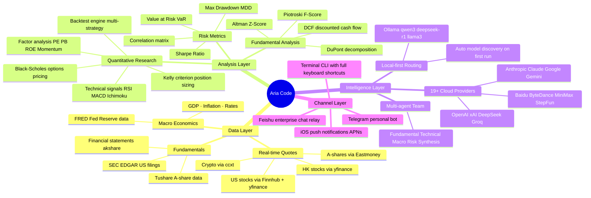

<p align="center">
  <picture>
    <source media="(prefers-color-scheme: dark)" srcset="docs/assets/logo-dark.svg" width="100">
    
  </picture>
</p>

<p align="center">
  <a href="./README_CN.md"></a>
  
</p>

<p align="center">
  <a href="https://www.npmjs.com/package/@artheras/aria-code"></a>
  <a href="https://pypi.org/project/aria-code/"></a>
  <a href="https://github.com/artherahq/aria-code/actions/workflows/ci.yml"></a>
  
  
  
  
  
</p>

<h1 align="center">Aria Code</h1>

<p align="center">
  <b>General-purpose AI product reviewer and coding agent</b><br>
  <sub>Review products · Understand repositories · Write and verify code · Optional finance capabilities</sub>
</p>

<p align="center">
  <a href="#-quick-start">Quick Start</a> ·
  <a href="#-keyboard-shortcuts">Shortcuts</a> ·
  <a href="#-model-support">Models</a> ·
  <a href="#-commands-reference">Commands</a> ·
  <a href="#-feishu-integration">Feishu</a> ·
  <a href="#-telegram-integration">Telegram</a> ·
  <a href="#-architecture">Architecture</a>
</p>

<p align="center">
  
</p>

---

## What is Aria Code?

Aria Code is a **terminal-first product and software-engineering agent**. It can review an uploaded product, understand an existing repository, find correctness and security risks, plan improvements, implement features, and verify code across common stacks. Financial and quantitative research remain available as optional domain capabilities rather than defining the default experience.

```
$ aria-code

  ▣ Aria Code  v4.1  local-first agent
  model      qwen2.5-coder:7b  local
  workspace  ~/my-portfolio
  mode       workspace-write · network on · local-only
  status     Ollama online · 3 models

  try  analyze AAPL  ·  /project load ./myapp  ·  /help

> analyze NVDA momentum — give me RSI, MACD, and a short thesis

  NVIDIA Corp (NVDA)  ── Technical Snapshot
  ─────────────────────────────────────────
  Price     $875.40    +2.3% today          (Finnhub real-time)
  RSI (14)  68.4       Approaching overbought
  MACD      +4.2       Bullish crossover 3 days ago
  BB Width  0.18       Moderate volatility

  Signal:  ↑ BULLISH  (momentum intact, watch RSI > 70)
  Support: $842 / $810     Resistance: $900 / $925

  Thesis: AI infrastructure spending cycle still early …

  1.9s · qwen2.5-coder:7b (local)
```

---

## ✨ What's New in v4.1

| Feature | Description |
|---------|-------------|
| **Bloomberg UI** | `/ui <desc>` generates Bloomberg Terminal-style HTML dashboards — amber-on-black, IBM Plex Mono, zero border-radius, `prefers-color-scheme` |
| **Tool transparency** | `✓ action (42ms)` after every tool call · per-turn cost display · phase dividers in multi-step commands |
| **User profile** | `~/.arthera/ARIA.md` auto-injected every session · `/memory profile add <text>` to persist your preferences |
| **Quant engine** | Citadel/Jane Street-style 5-module engine · limit-up prediction · dynamic market pool |
| **MCP tools** | 5 new quantitative MCP tools in the tool registry |
| **83 commands** | Consolidated from ~150 — removed all LLM-replaceable commands; natural language handles the rest |
| **LLM routing fix** | Model now knows it can call real-time data tools instead of saying "I don't have live data" |
| **Unified agent loop** | CLI, SDK and self-host backend now run the *same* tested runtime (`runtime.run_turn`) — consistent provider routing, cloud→local fallback and tool execution on every surface |
| **Warehouse ERP agents** | Read-only carrier-sync, inbound-exception and inventory-health analysis with a dedicated operational signal scheme; see [data contract](docs/warehouse-erp-agents.md) |
| **One-command install** | `pip install aria-code` (PyPI) or `npm install -g @artheras/aria-code` — verified clean on Python 3.10 / 3.11 / 3.12 |

See [CHANGELOG.md](CHANGELOG.md) for the full history.

### v4.0 highlights

| Feature | Description |
|---------|-------------|
| ⌨️ **Keyboard shortcuts** | `Shift+Tab` cycle modes · `Alt+T` thinking · `Alt+P` model picker · `Ctrl+O` transcript · `Ctrl+T` tasks |
| `!` **Shell mode** | Type `! git status` to run shell commands, output auto-added to AI context |
| `@` **Typed context references** | Attach files, folders, assets, portfolios, strategies, datasets, runs, or reports without executing an action |
| `/btw` **Side questions** | Ask quick questions without polluting conversation history |
| 🌍 **Auto language** | UI and responses auto-detect Chinese/English from OS locale on first run |
| 🤖 **19+ cloud providers** | Google Gemini · xAI Grok · Mistral · Cohere · Perplexity · Baidu ERNIE · ByteDance · MiniMax · StepFun · 01.AI + all originals |
| 🔢 **All Ollama models** | Qwen3 · DeepSeek-R1 · Llama 3.x · Phi-4 · Gemma3 · Mistral families |

---

## 🧠 Intelligence Pipeline


```mermaid
mindmap
  root((Aria Code))
    Data Layer
      Real-time Quotes
        A-shares via Eastmoney
        US stocks via Finnhub + yfinance
        HK stocks via yfinance
        Crypto via ccxt
      Fundamentals
        Financial statements akshare
        SEC EDGAR US filings
        Tushare A-share data
      Macro Economics
        FRED Fed Reserve data
        GDP · Inflation · Rates
    Analysis Layer
      Quantitative Research
        Technical signals RSI MACD Ichimoku
        Factor analysis PE PB ROE Momentum
        Backtest engine multi-strategy
        Kelly criterion position sizing
        Black-Scholes options pricing
      Fundamental Analysis
        DCF discounted cash flow
        Piotroski F-Score
        Altman Z-Score
        DuPont decomposition
      Risk Metrics
        Max Drawdown MDD
        Sharpe Ratio
        Value at Risk VaR
        Correlation matrix
    Intelligence Layer
      Local-first Routing
        Ollama qwen3 deepseek-r1 llama3
        Auto model discovery on first run
      19+ Cloud Providers
        Anthropic Claude Google Gemini
        OpenAI xAI DeepSeek Groq
        Baidu ByteDance MiniMax StepFun
      Multi-agent Team
        Fundamental Technical Macro Risk Synthesis
    Channel Layer
      Terminal CLI with full keyboard shortcuts
      Feishu enterprise chat relay
      Telegram personal bot
      iOS push notifications APNs
```

---

## ✨ Core Features

| Capability | Details |
|-----------|---------|
| 🦙 **100% offline mode** | Powered by Ollama — no API key, no data leaves your machine |
| 📊 **Financial intelligence** | DCF / WACC / PE / Sharpe / Kelly / Black-Scholes + 30 more built-in formulas |
| 📈 **Live market data** | A-shares (Eastmoney) · US stocks (Finnhub) · HK · Crypto (ccxt) |
| 🔍 **Quant research** | `/backtest` `/signal` `/kelly` `/factor` `/portfolio` `/screen` `/corr` `/ptbt` |
| 🤖 **19+ cloud providers** | All major international + Chinese LLM APIs supported |
| 🔌 **MCP protocol** | Connect any [Model Context Protocol](https://modelcontextprotocol.io) server |
| ⌨️ **Rich keyboard UX** | Vim mode · `!` shell · typed `@` context · `Shift+Tab` modes · transcript viewer |
| 💬 **Feishu / Telegram** | Ask Aria from any chat app, anytime |
| 📱 **iOS push alerts** | Real-time price alerts via APNs |
| 🌍 **Auto bilingual** | OS language auto-detected on first run; output follows user's input language |
| 🏠 **Real estate** | Property valuation, REIT screening, rental yield, 70-city China housing |

---

## 🚀 Quick Start

### Option 1: npm (Claude Code style — Recommended)

If you have [Node.js](https://nodejs.org) (≥ 16) installed, get started in one command:

```bash
npm install -g @artheras/aria-code
aria-code
```

Update anytime: `npm update -g @artheras/aria-code`

### Option 2: Bootstrap (One-liner for fresh Mac / Linux)

No Node.js, Python, or Xcode required. One command automatically sets up everything:

```bash
curl -fsSL https://raw.githubusercontent.com/artherahq/aria-code/main/bootstrap.sh | bash
```

### Option 3: PyPI (Python Package)

Aria Code is published on PyPI — install into your Python 3.10 ~ 3.13 environment:

```bash
uv tool install "aria-code[full]"      # isolated, fast (recommended)
# or standard pip:
pip install "aria-code[full]"          # full version with all data sources
```

### Option 4: Git Clone & Source Install

```bash
# macOS / Linux
git clone https://github.com/artherahq/aria-code.git
cd aria-code
bash install.sh

# Windows
git clone https://github.com/artherahq/aria-code.git
cd aria-code
powershell -ExecutionPolicy Bypass -File .\install.ps1
```
```

### Option 5: PyPI (pip / uv / pipx)

Aria Code ships a proper Python package, so any standard tool works:

```bash
uv tool install aria-code          # isolated, fast (recommended)
pipx install aria-code             # isolated alternative
pip install aria-code              # into the current environment
```

This installs the **slim core** (CLI + yfinance). Add features with extras:

```bash
uv tool install "aria-code[full]"      # all data sources + files + charts + SQL
pip install "aria-code[cn]"            # + China A-share data (akshare)
pip install "aria-code[files]"         # + PDF/Word/Excel parsing
pip install "aria-code[all]"           # + brokers + backtest + dev tools
```

Available extras: `cn` · `crypto` · `charts` · `data` · `files` · `web` ·
`browser` · `desktop` · `sports` · `lsp` · `brokers` · `backtest` · `full` · `all`.

### Option 6: Run directly (no install)

```bash
git clone https://github.com/artherahq/aria-code.git
cd aria-code
uv venv && uv pip install -e ".[full]"   # uv (fast); or use python -m venv + pip
aria-code
```

### 🇨🇳 China / behind a firewall (network timeouts)

If installs time out reaching GitHub or PyPI (e.g. `curl: (56) Recv failure`),
set `ARIA_CN=1` — every installer then uses the Tsinghua PyPI mirror and a
Python-build mirror. The installers also auto-retry through these mirrors if a
download fails, so you usually don't need the flag.

```bash
ARIA_CN=1 bash install.sh                 # git clone path
ARIA_CN=1 npm install -g @artheras/aria-code   # npm path
```

```powershell
$env:ARIA_CN=1; .\install.ps1             # Windows
```

You can also point at your own mirrors via standard env vars:
`UV_DEFAULT_INDEX`, `UV_PYTHON_INSTALL_MIRROR`, `PIP_INDEX_URL`.

### Step 1: Install Ollama (local LLM — free, fully offline)

```bash
# macOS / Linux
curl -fsSL https://ollama.ai/install.sh | sh

# Pull a model (choose one — auto-detected on first run)
ollama pull qwen2.5-coder:7b    # Recommended — fast, great Chinese support (~4.7GB)
ollama pull qwen3:8b            # Latest Qwen, stronger reasoning
ollama pull deepseek-r1:7b      # Strong reasoning for complex quant tasks
ollama pull llama3.2:3b         # Smallest, fastest (~2GB)
ollama pull phi4-mini           # Microsoft Phi-4 mini, excellent code
```

Aria auto-discovers the best installed model on first run — no configuration needed.

### Step 2: Cloud API keys (all optional)

```bash
# Interactive setup wizard
python3 -m aria_code.setup_wizard

# Or manually copy and edit
cp .env.example .env
```

The setup wizard now covers all 19 cloud providers including Google Gemini, xAI Grok, Mistral, Baidu ERNIE, ByteDance Doubao, and more.

---

## ⌨️ Keyboard Shortcuts

Aria Code has a full keyboard shortcut system powered by `prompt_toolkit`:

### General

| Shortcut | Action |
|----------|--------|
| `Shift+Tab` | Cycle permission modes: `read-only` → `workspace-write` → `full-access` |
| `Alt+T` | Toggle thinking mode on/off |
| `Alt+P` | Open model switcher (fills `/model` in prompt) |
| `Ctrl+O` | Toggle transcript viewer — shows all tool calls with timestamps |
| `Ctrl+T` | Toggle task list — live pending/in-progress/done indicator |
| `Ctrl+L` | Redraw terminal screen (fixes garbled display) |
| `Ctrl+C` | Cancel current response / clear input |
| `Ctrl+D` | Exit Aria |
| `Esc` | Interrupt streaming response |

### Uploaded project review service

Aria Code can also run as an internal, read-only reviewer behind the Arthera
API gateway. It accepts bounded `.zip`, `.tar`, `.tar.gz`, or `.tgz` source
archives, skips sensitive and generated files, and never executes uploaded
code or installs its dependencies.

```bash
pip install -e '.[service]'
export ARIA_CODE_REVIEW_TOKEN='use-a-long-random-shared-token'
uvicorn aria_code.project_review_server:app --host 0.0.0.0 --port 8787
```

The public client uploads to Arthera at `POST /api/v2/aria-code/project-reviews`;
clients must never receive the internal review token. Authenticated coding runs
can also import an archive through `POST /api/v2/aria-code/workspaces`. The
internal service expands it into a tenant-bound, expiring workspace with
execution and network access disabled. Its initial tool profile is read-only:
list files, read text, and search code. Coding agents may stage a complete text
change and receive a unified diff, but that proposal cannot touch the source
tree until the Arthera control plane verifies a matching one-time approval.
Applied changes retain an integrity-checked rollback checkpoint. Mount
`ARIA_CODE_WORKSPACE_ROOT` on a private persistent volume and run the service
with `ARIA_RUNTIME_SCOPE=remote`.

### Input Modes

| Prefix | Mode | Example |
|--------|------|---------|
| `/` | Slash command with fuzzy autocomplete | `/backtest momentum SPY` |
| `!` | Shell mode — runs command, adds output to context | `! git diff HEAD~1` |
| `@` | Read-only typed context reference | `@file:src/app.py` · `@asset:AAPL` |
| `"""` | Multi-line input mode (end with `"""`) | For pasting code blocks |

`/` and `@` are intentionally different: `/` selects an action; `@` selects
context for that action or for a natural-language request. They can be combined:

```text
/risk @portfolio:core
/backtest @strategy:momentum-v2 @asset:AAPL --period 3y
Review @folder:apps/cli against @report:last-audit
```

Available reference types: `@file:`, `@folder:`, `@asset:`, `@portfolio:`,
`@strategy:`, `@dataset:`, `@run:`, and `@report:`. A plain `@path` remains a
file reference for compatibility; unknown references fail locally instead of
being guessed by the model. References contain pointers only: Aria reads them
on demand through audited tools such as `read_file`, `list_files`,
`analyze_file`, and `get_market_data`; source content is never silently
expanded into the prompt.

### Bottom Toolbar (always visible)

```
qwen2.5-coder:7b · ~/my-project ⎇ main ✓3/5 · rw · local-only · /help · 1,240/16,384
│                    │           │      │       │    │
│                    │           │      │       │    └── context usage
│                    │           │      │       └── privacy status
│                    │           │      └── permission: ro/rw/full (color-coded)
│                    │           └── task progress
│                    └── git branch
└── current model
```

---

## 🤖 Model Support

### Local Models (via Ollama — offline, free)

| Model | Command | Size | Best For |
|-------|---------|------|----------|
| **qwen2.5-coder:7b** ⭐ | `ollama pull qwen2.5-coder:7b` | 4.7GB | Code + Chinese (recommended) |
| qwen3:8b | `ollama pull qwen3:8b` | 5.2GB | Latest Qwen, reasoning |
| qwen3:30b-a3b | `ollama pull qwen3:30b-a3b` | 17GB | High capability |
| deepseek-r1:7b | `ollama pull deepseek-r1:7b` | 4.7GB | Strong math/reasoning |
| deepseek-r1:1.5b | `ollama pull deepseek-r1:1.5b` | 1.1GB | Ultra-light reasoning |
| llama3.2:3b | `ollama pull llama3.2:3b` | 2GB | General, fastest |
| llama3.1:8b | `ollama pull llama3.1:8b` | 4.7GB | General purpose |
| mistral:7b | `ollama pull mistral:7b` | 4.1GB | European quality |
| phi4-mini | `ollama pull phi4-mini` | 2.5GB | Excellent code, small |
| gemma3:4b | `ollama pull gemma3:4b` | 3.3GB | Google, efficient |

Switch model anytime:

```bash
/model                    # Interactive picker with install status
/model qwen3:8b           # Direct switch
/model openai/gpt-4.5     # Cloud model
Alt+P                     # Keyboard shortcut
```

### Cloud Providers (19+ supported)

#### International

| Provider | Models | Env Var |
|----------|--------|---------|
| **Anthropic** | Claude Sonnet 4, Opus 4 | `ANTHROPIC_API_KEY` |
| **OpenAI** | GPT-4.5, o3, o4-mini | `OPENAI_API_KEY` |
| **DeepSeek** | deepseek-chat, deepseek-reasoner | `DEEPSEEK_API_KEY` |
| **Google Gemini** | gemini-2.0-flash, 2.5-pro | `GOOGLE_API_KEY` |
| **xAI Grok** | grok-3, grok-3-fast | `XAI_API_KEY` |
| **Groq** | llama-3.3-70b (fast inference) | `GROQ_API_KEY` |
| **Mistral** | mistral-large, codestral | `MISTRAL_API_KEY` |
| **Cohere** | command-r-plus | `COHERE_API_KEY` |
| **Perplexity** | sonar-pro (web search) | `PERPLEXITY_API_KEY` |
| **Together AI** | 100+ open-source models | `TOGETHER_API_KEY` |

#### Chinese Providers (国内)

| Provider | Models | Env Var |
|----------|--------|---------|
| **SiliconFlow 硅基流动** | Qwen/DeepSeek hosted | `SILICONFLOW_API_KEY` |
| **DashScope 阿里百炼** | qwen-max, qwen-turbo | `DASHSCOPE_API_KEY` |
| **Moonshot Kimi** | moonshot-v1-128k | `MOONSHOT_API_KEY` |
| **Zhipu GLM 智谱** | glm-4-plus | `ZHIPU_API_KEY` |
| **Baidu ERNIE 百度千帆** | ernie-4.5-turbo | `QIANFAN_ACCESS_KEY` |
| **ByteDance Doubao 豆包** | (endpoint-based) | `ARK_API_KEY` |
| **MiniMax** | MiniMax-Text-01 | `MINIMAX_API_KEY` |
| **StepFun 阶跃星辰** | step-2-16k | `STEPFUN_API_KEY` |
| **01.AI Yi 零一万物** | yi-large | `ONEAI_API_KEY` |

Use any provider:

```bash
/model anthropic/claude-sonnet-4-6
/model google/gemini-2.0-flash-exp
/model baidu/ernie-4.5-turbo-128k
/model moonshot/moonshot-v1-128k
/apikey       # Interactive wizard for all 19 providers
```

---

## ⚡ Commands Reference

### Market & Quotes

```bash
/quote AAPL MSFT TSLA              # Real-time multi-symbol quotes (Finnhub)
/quote 000001 600519 300750        # A-share quotes (Eastmoney)
/quote BTC/USDT ETH/USDT           # Crypto prices
/news AAPL                         # Latest financial news
/regime                            # Market regime (bull / bear / neutral)
/alert add AAPL gt 200             # Price alert
/alert list                        # View all alerts
```

### Quantitative Research

```bash
/signal TSLA                       # Technical signals (RSI / MACD / Bollinger)
/backtest momentum SPY 2023-01-01 2024-12-31
/backtest ml 600519 300750 NVDA    # ML signal backtest (3-strategy comparison)
/wf SPY momentum                   # Walk-forward backtest
/kelly AAPL 0.6 2.0                # Kelly formula — position size recommendation
/factor PE PB ROE                  # Multi-factor analysis
/screen PE<15 ROE>20               # Stock screener with filters
/portfolio AAPL MSFT GOOGL         # Portfolio optimization
/ptbt AAPL MSFT GOOG 0.4 0.3 0.3  # Portfolio backtest with weights
/corr AAPL MSFT TSLA SPY           # Correlation matrix
/ichimoku AAPL                     # Ichimoku cloud chart
/options AAPL calls 2025-01        # Options chain
/quality AAPL                      # Piotroski + Altman Z-score
```

### Analysis

```bash
/analyze AAPL                      # AI full analysis
/peer AAPL MSFT GOOGL META         # Peer comparison
/macro                             # Macro dashboard (GDP / CPI / Fed rates)
/macro cn                          # China macro data
/sector tech                       # Sector analysis
/realty Shanghai Pudong            # Real estate analysis
/feargreed                         # Crypto Fear & Greed Index
/funding BTC ETH                   # Perpetual funding rates
```

### Session & UI

```bash
/btw what was that function name?  # Side question — no history pollution
/recap                             # Session summary (turns + topics)
/clear                             # Clear conversation
/compact                           # Smart context compression
/history                           # Show recent conversation
/sessions                          # List saved sessions
/export md report.md               # Export conversation
/rename "NVDA Research"            # Name current session
```

### System

```bash
/model                             # View / switch LLM (interactive picker)
/apikey                            # API key wizard for all 19 providers
/config set ui_lang=zh             # Force Chinese UI
/config set ui_lang=en             # Force English UI
/thinking on                       # Enable extended thinking mode
/privacy status                    # Privacy settings
/tools                             # List all enabled tools
/skills                            # List skills
/mcp list                          # MCP server status
/doctor                            # Diagnose installation issues
/providers                         # All provider status
```

---

## 🌍 Language Auto-Detection

On first run, Aria reads your OS locale and sets the UI language automatically:

```bash
# Chinese system → Chinese UI + hints
LANG=zh_CN.UTF-8  →  本地优先智能体 · Ollama 在线 · 试试 分析 AAPL

# English system → English UI + hints
LANG=en_US.UTF-8  →  local-first agent · Ollama online · try analyze AAPL
```

AI **output language** always follows your input — ask in Chinese, get Chinese; ask in English, get English.

Override anytime:

```bash
/config set ui_lang=zh    # Force Chinese
/config set ui_lang=en    # Force English
/config set ui_lang=auto  # Back to OS auto-detect
```

---

## 💬 Feishu Integration

Connect Aria to Feishu (Lark) and ask financial questions from any group or DM.

### How it works

```
Your Feishu message
       │
       ▼
  Feishu servers
       │
  ┌────┴────────────────────────────────────┐
  │  Mode A: Relay (recommended, 5 min)     │  Mode B: Own App (20 min)
  │  Aria Relay Server                       │  Feishu Open Platform App
  │  wss://relay.aria.ai                     │  Requires public IP or tunnel
  └────┬────────────────────────────────────┘
       │
       ▼
 aria_relay_client.py  (your machine)
       │
       ▼
 aria_cli.py → LLM → response sent back
```

### Mode A: Relay (Recommended)

```bash
python3 -m aria_code.setup_wizard
# Select "Feishu relay mode"
# Output: ✅ Your Client ID: ARIA-xxxxxxxx-xxxx
```

Send to the **Aria Bot** in Feishu:

```
/bind ARIA-xxxxxxxx-xxxx
```

Configure `~/.aria/.env`:

```env
ARIA_RELAY_URL=wss://relay.aria.ai
ARIA_RELAY_CLIENT_ID=ARIA-xxxxxxxx-xxxx
ARIA_RELAY_MODE=relay
ARIA_CODE_DIR=~/aria-code
```

Start:

```bash
python3 aria_daemon.py start
```

### Mode B: Own Feishu App

1. Open [Feishu Open Platform](https://open.feishu.cn/app) → Create custom app
2. Set event URL: `https://yourdomain.com/api/v1/feishu/webhook`
3. Subscribe to `im.message.receive_v1`

```env
FEISHU_APP_ID=cli_xxxxxxxxxxxxxxxxx
FEISHU_APP_SECRET=xxxxxxxxxxxxxxxxxxxxxxxxxxxxxxxx
ARIA_RELAY_MODE=own_app
```

---

## 📱 Telegram Integration

### Setup

1. Message **@BotFather** → `/newbot` → copy your **Bot Token**
2. Message **@userinfobot** → copy your **Chat ID**

Configure:

```env
TELEGRAM_BOT_TOKEN=1234567890:ABCDEFGxxxxxxxxxxxxxx
TELEGRAM_ALLOWED_IDS=123456789
ARIA_CODE_DIR=~/aria-code
```

Start:

```bash
python3 aria_daemon.py start
```

Use in Telegram:

```
/price AAPL                → Apple real-time quote
/price 600519              → Moutai A-share
/price BTC/USDT            → Bitcoin
Analyze NVDA momentum      → Full AI analysis
```

---

## 📡 TradingView Alerts

Pipe TradingView alerts into Aria: the daemon receives the webhook, verifies
it, and runs a tool-less AI analysis through the shared runtime gateway, then
pushes the result to your notify channels (Telegram / Feishu).

### Setup

```env
ARIA_WEBHOOK_SECRET=your-strong-passphrase   # REQUIRED for non-local use
ARIA_WEBHOOK_HOST=127.0.0.1                  # bind address (default local-only)
ARIA_WEBHOOK_PORT=8765
ARIA_DAEMON_MODEL=qwen2.5:7b                 # model for alert analysis
```

```bash
python3 aria_daemon.py start
# endpoint: POST http://127.0.0.1:8765/api/v1/webhook/tradingview
```

### TradingView alert message (Webhook URL → your public endpoint)

```json
{
  "symbol": "{{ticker}}",
  "action": "{{strategy.order.action}}",
  "price": "{{close}}",
  "message": "MA cross on {{interval}}",
  "passphrase": "your-strong-passphrase"
}
```

### Security model

- **Passphrase (fail-closed):** with `ARIA_WEBHOOK_SECRET` set, alerts without
  a matching `passphrase` are rejected (constant-time compare). TradingView
  cannot send custom headers, so the body passphrase is the documented way.
- **Open-mode guard:** with *no* secret and *no* `WEBHOOK_TOKEN` configured,
  only loopback clients may submit — a non-local request gets `403` with a
  fix-it message instead of silently accepting injected buy/sell alerts.
- **HMAC option:** a fronting relay that can sign requests may send
  `sha256=<hex>` of the raw body; HMAC verification never runs in open mode.
- **Analysis, not trading:** the alert turn runs with an empty tool set and a
  prompt that forbids order placement. Order *previews* (when a broker is
  configured) still require explicit confirmation via the preview flow.

---

## 🏗️ Architecture

```
┌─────────────────────────────────────────────────────────────────┐
│                          Aria Code v4.0                         │
│                                                                 │
│  ┌──────────┐  ┌────────────┐  ┌──────────┐  ┌─────────────┐ │
│  │ Terminal │  │Feishu Bot  │  │ Telegram │  │   Webhook   │ │
│  │   CLI    │  │(relay/app) │  │   Bot    │  │  External   │ │
│  └────┬─────┘  └─────┬──────┘  └────┬─────┘  └──────┬──────┘ │
│       └───────────────┴──────────────┴────────────────┘        │
│                               │                                 │
│                     ┌─────────▼──────────┐                     │
│                     │   aria_daemon.py    │                     │
│                     │  Message router     │                     │
│                     └─────────┬──────────┘                     │
│                               │                                 │
│              ┌────────────────┼────────────────┐               │
│              │                │                │               │
│   ┌──────────▼───┐  ┌─────────▼───┐  ┌────────▼──────┐       │
│   │  LLM Router  │  │  Tool Exec  │  │  Data Layer   │       │
│   │19+ providers │  │  bash/file  │  │Finnhub/EastMny│       │
│   └──────────────┘  └─────────────┘  └───────────────┘       │
└─────────────────────────────────────────────────────────────────┘
```

### File Structure

```
aria-code/
└── src/aria_code/             # Main package
    ├── aria_cli.py            # CLI core (session state, slash-command dispatch)
    ├── aria_mcp_server.py     # MCP server entry point
    ├── apps/cli/
    │   ├── i18n.py            # Language auto-detection + UI string translations
    │   ├── commands/
    │   │   └── model_cmds.py  # /model /apikey /providers (19 cloud providers)
    │   ├── prompts/
    │   │   └── coding.py      # Code generation prompts (end_date fix, akshare fallback)
    │   └── tools/
    │       └── market_tools.py # Market data tools (Finnhub dp field)
    ├── ui/
    │   ├── banner.py          # Bilingual banner (i18n aware)
    │   └── completer.py       # Fuzzy autocomplete: / commands · @ context · ! history
    ├── providers/llm/         # LLM adapters (19+ cloud endpoints)
    ├── agents/financial/      # Fundamental / Technical / Macro / Risk / Synthesis
    ├── brokers/                # CN (Futu/Longbridge/Tiger) + Intl (IBKR/Alpaca)
    └── datasources/sources/   # yfinance · akshare · FRED · EDGAR · Finnhub
```

---

## 📡 Market Data Sources

| Source | Coverage | API Key |
|--------|----------|---------|
| **Finnhub** ⭐ | US real-time quotes (primary) + earnings | Optional free tier |
| **Eastmoney** | A-share real-time, northbound flow, limit-up/down | None (free) |
| **akshare** | A-share history, financials, sector data | None (free) |
| **yfinance** | US/HK/global stocks, ETFs, FX, history | None (free) |
| **ccxt** | 100+ crypto exchanges | None (free tier) |
| **FRED** | Fed macro — GDP, CPI, rates | Optional (free signup) |
| **SEC EDGAR** | US 10-K / 10-Q filings | None (free) |
| Alpha Vantage | US history + fundamentals | Optional (free tier) |
| Polygon | US market data (professional) | Optional (free tier) |
| Tushare | A-share complete data | Optional (free token) |

---

## 🔌 MCP Integration

Connect any [Model Context Protocol](https://modelcontextprotocol.io) server:

```json
{
  "servers": [
    {
      "name": "filesystem",
      "command": "npx",
      "args": ["-y", "@modelcontextprotocol/server-filesystem", "/your/project"]
    },
    {
      "name": "brave-search",
      "command": "npx",
      "args": ["-y", "@modelcontextprotocol/server-brave-search"],
      "env": { "BRAVE_API_KEY": "your-key" }
    }
  ]
}
```

```bash
/mcp list      # List connected MCP servers
/mcp status    # Server health
/mcp tools     # All available MCP tools
```

### Expose aria-code to other MCP clients

aria-code can also run *as* an MCP server, so Claude Code, Codex, or any
other MCP client can call into it directly:

- `aria.market.quote` / `aria.agent.team` / `aria.artifacts.list` — live quote + technicals, multi-agent research, generated artifacts (all read-only)
- `aria.skill.list` / `aria.skill.get` — discover and fetch the installed portable [SKILL.md](https://github.com/artherahq/aria-skills) workflows: reusable expert playbooks for UI design systems, anti-generic-AI-look design critique, trading-app patterns, equity research, backtest validation, and more. `aria.skill.list` takes an optional `query` to rank by relevance to your task; `aria.skill.get` returns the full workflow text for **you** to follow — skills are instruction documents, not executable tools, so nothing runs server-side. Each result carries an `integrity` field (`verified` for signed catalog skills, `unlocked` for local drop-ins) so you can see a skill's provenance before following it
- `aria.report.generate` — fetch data and generate a full HTML research report artifact for a symbol
- `aria.backtest.run` — run a historical strategy simulation (`buy_hold` or `sma_cross`) against real price history
- `aria.broker.positions` / `aria.broker.list_previews` — read account/positions and recent order previews for a configured broker (US/CN/HK/UK — see `/broker`)
- `aria.broker.preview_order` — build a risk-checked order preview. **Never places a live trade by itself** — execution requires either a human running `/trade confirm <preview_id>` in the aria-code terminal, or `aria.broker.confirm_order` below (off by default per broker)
- `aria.broker.confirm_order` — **execute a previously built order preview, for real.** Off by default for every broker. Refuses unconditionally unless (1) a human already ran `/trade allow-chat-confirm <broker_id>` at the aria-code terminal keyboard — retyping the exact broker id, not y/yes — to opt that specific broker into chat-confirmed execution (this opt-in can never be triggered from MCP/chat, only from the terminal), **and** (2) the call itself passes `confirmed: true`. Executions via this path are tagged `source: "chat_mcp"` in the trade audit log (`~/.aria-code/trade_audit.jsonl`) to distinguish them from terminal-confirmed trades. Run `/trade disallow-chat-confirm <broker_id>` at any time to turn it back off
- `aria.report.chart` — candlestick + MA20/50 chart PNG for a symbol
- `aria.report.indicator_chart` — candlestick + volume + RSI(14) + MACD(12,26,9) multi-panel chart PNG for a symbol
- `aria.report.comparison_chart` — normalized (base=100) % return comparison chart PNG across 2+ symbols
- `aria.report.allocation_chart` — pie chart PNG of a broker account's position weights by market value
- `aria.report.pdf` / `aria.report.docx` / `aria.report.pptx` — render a Markdown report to PDF, an editable Word document, or a slide deck (one slide per heading) — all chart/report tools save to your artifacts folder
- `aria.report.canva_design` / `aria.report.canva_upload_asset` — fill a Canva brand template with data (and optionally an uploaded image asset) and export a design draft (needs `/canva connect <client_id> <client_secret>` once — register an app at [canva.com/developers](https://www.canva.com/developers/) and have a brand template ready first; Canva has no API for creating a design from scratch, only autofilling an existing template)
- `aria.figma.read_file` / `aria.figma.comments` — read a Figma file's page/frame structure (depth-limited summary) and its comments (needs `/apikey set figma <personal_access_token>` once). Read-only — Figma has no public API for writing/creating designs from a script, only its in-app Plugin API can do that
- `aria.report.estimate_image_cost` — get an illustrative per-image cost estimate (USD) for OpenAI's `gpt-image-1` at a given size/quality, before generating. Free.
- `aria.report.generate_image` / `aria.report.edit_image` — generate a new image or transform an existing local photo via OpenAI's `gpt-image-1` (needs `/apikey set openai sk-...`). `edit_image` accepts an optional `mask_path` for inpainting — a mask PNG where transparent areas mark what to edit, opaque areas are preserved untouched. **Real per-call cost, billed the instant it succeeds** — both hard-refuse without `confirmed: true`, and calling `aria.report.estimate_image_cost` first is strongly recommended
- `aria.report.generate_image_local` / `aria.report.edit_image_local` — the same, entirely locally via a self-hosted SDXL-Turbo (no API key, no per-call cost; needs the optional `image_gen` extra and ~4GB of weights on first use)
- `aria.video.probe` / `aria.video.trim` / `aria.video.concat` / `aria.video.overlay_text` / `aria.video.overlay_audio` / `aria.video.convert` / `aria.video.change_speed` — deterministic local video editing via `ffmpeg` (no AI, no API key)
- `aria.video.transcribe` / `aria.video.detect_scenes` — local AI-assisted analysis: speech transcription (`faster-whisper`, needs the optional `video_analysis` extra) and scene-cut detection (`opencv`, needs the optional `video` extra) — both produce editing *decisions*, not new pixels
- `aria.video.generate_estimate` / `aria.video.generate_submit` / `aria.video.generate_status` — cloud AI text-to-video via Kling or Runway (`provider: "kling" | "runway"`). **Real per-request cost, billed the instant submission succeeds** — `generate_submit` hard-refuses without `confirmed: true`, and calling `generate_estimate` first is strongly recommended. Needs `/apikey set kling <access_key>:<secret_key>` or `/apikey set runway <key>`. No local/free option exists for this layer the way SDXL-Turbo covers images — see `video_editor.py`/`video_analysis.py` for the free local-only editing/analysis layers

```bash
python3 aria_mcp_server.py          # dev, from the repo root
# or, once installed: aria-code-mcp
```

Register with Claude Code:

```bash
claude mcp add aria-code -- python3 /path/to/aria-code/aria_mcp_server.py
```

Register with Codex (`~/.codex/config.toml`):

```toml
[mcp_servers.aria_code]
command = "python3"
args = ["/path/to/aria-code/aria_mcp_server.py"]
```

#### Want deeper A-share quant tools too? Register a second server, don't wait for us to add them here

This server intentionally does **not** re-expose Arthera's `quant_engine` quant
tools (factor calculation, Bayesian-HMM regime detection, northbound-flow,
Kelly position sizing, options pricing, pairs-trading stats, and a much
deeper `run_backtest` than the one above — T+1 settlement, limit-up/down
filtering, `sma_cross`/`rsi_mean_revert`/`momentum` strategies, CN_A or US
market). That's a separate project (Arthera) with its own MCP server —
`packages/quant_engine/mcp_server.py` — speaking the identical MCP
2024-11-05 stdio JSON-RPC protocol, so any client here can register it
as a second, independent server rather than this one proxying it:

```bash
claude mcp add arthera-quant -- python3 /path/to/Arthera/packages/quant_engine/mcp_server.py
```

We keep these two separate on purpose, not as a gap to close later: a few of
`quant_engine`'s tools (`get_ai_signal`, `get_predictions`,
`get_market_insights`) call Arthera's own internal Alibaba Cloud service and
simply won't work without that access, so folding them into this server
would mean shipping tools that error out for anyone without Arthera's
private infrastructure. If you don't have access to that repo, everything
above this section still works standalone.

---

## ⚙️ Configuration

Settings are stored in `~/.arthera/config.json`. Add `.ariarc` to any project for project-level overrides:

```json
{
  "model": "qwen2.5-coder:7b",
  "ui_lang": "auto",
  "market": "us",
  "permission_mode": "workspace-write",
  "default_symbols": ["AAPL", "NVDA", "MSFT", "GOOGL"],
  "thinking": false
}
```

### LLM Provider Priority

Aria automatically selects the first available provider:

```
Local Ollama  →  Anthropic  →  OpenAI  →  DeepSeek  →  Google  →  xAI  →  Groq  →  …
(offline first)  (reasoning)   (general)  (cost-eff.)  (multi.)  (web)  (fast)
```

Force local mode: `ARIA_MODEL=ollama/qwen2.5-coder:7b`

---

## 🛠️ Requirements

- Python **3.10+**
- [Ollama](https://ollama.ai) (highly recommended for offline mode)
- RAM: 4GB+ (8GB+ for 7B models)
- macOS · Linux · Windows (WSL2)

```bash
pip install -r requirements.txt
```

Core dependencies: `rich` · `prompt_toolkit` · `yfinance` · `akshare` · `ccxt` · `pandas` · `numpy`

---

## 🤝 Contributing

Contributions welcome! See [CONTRIBUTING.md](./CONTRIBUTING.md).

```bash
git clone https://github.com/artherahq/aria-code.git
cd aria-code
python3 -m venv .venv && source .venv/bin/activate
pip install -r requirements.txt
pytest tests/ -v
```

---

## Relation to Arthera

Aria Code is the open-source CLI component of [Arthera](https://arthera.finance) — an AI-powered quantitative investment platform. The full Arthera platform includes a web dashboard, desktop terminal, iOS app, and institutional quant engine.

Aria Code is designed to work as a **standalone tool** — it does not require the Arthera backend. All financial calculations run locally. Cloud features are optional.

---

## License

[Business Source License 1.1](./LICENSE) © 2025–2026 Arthera.

Free to use, run, modify, and self-host for personal, internal, educational,
and research purposes — including trading your own account. Offering Aria Code
as a hosted/managed service, or selling a competing product built on it,
requires a commercial license (contact dev@arthera.finance). Each version
converts to Apache 2.0 four years after release.

> Versions up to and including **4.1.2** were released under MIT and remain
> available under those terms.

---

<p align="center">
  <a href="https://arthera.finance">Website</a> ·
  <a href="https://github.com/artherahq/aria-code">Project Repository</a> ·
  <a href="https://github.com/artherahq/aria-code/issues">Issues</a> ·
  <a href="https://github.com/artherahq/aria-code/discussions">Discussions</a>
</p>
