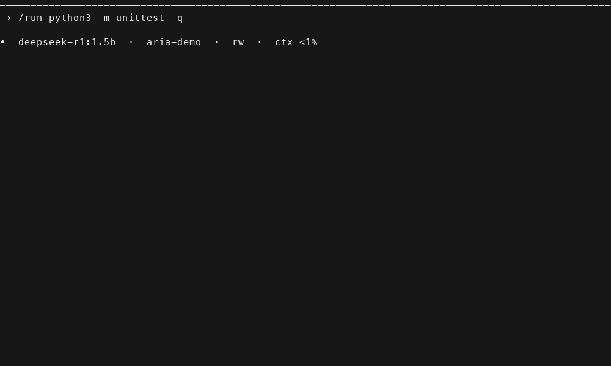

<p align="center">
  <picture>
    <source media="(prefers-color-scheme: dark)" srcset="docs/assets/aria-code-icon.png">
    
  </picture>
</p>

<h1 align="center">Aria Code</h1>

<p align="center">A terminal-first AI workspace for code and research.<br>
Work in your project, use local or cloud models, and connect domain tools when you need them.</p>

<p align="center"><a href="README_CN.md">简体中文</a> · English</p>

<p align="center">
  <a href="https://www.npmjs.com/package/@artheras/aria-code"></a>
  <a href="https://pypi.org/project/aria-code/"></a>
  <a href="https://github.com/artherahq/aria-code/actions/workflows/ci.yml"></a>
  <a href="LICENSE"></a>
</p>

<p align="center"></p>
<p align="center"><sub>Recorded from a real Aria Code terminal session on a temporary test fixture; idle time is shortened. This shows direct CLI commands, not an autonomous model edit. <a href="docs/assets/demo-coding-workflow.png">Still screenshot</a> · <a href="scripts/render_terminal_capture.py">Capture renderer</a>.</sub></p>

## What Aria Code does

Aria Code can inspect project files, propose and apply edits, run commands and tests, and explain the resulting changes. It also supports research and optional domain tools, including financial analysis and read-only warehouse operations. Those tools require their own data sources or integrations; a fresh install does not provide live business data.

The same core runtime is used by the CLI and other Aria surfaces. Model choice and tool permissions are separate: you can use a local Ollama model, configure a supported cloud provider, or sign in to the Arthera service. A cloud model or live data source needs network access.

## Quick start

Requires Python 3.10 or newer. Install the CLI from PyPI and start an interactive session:

```bash
python3 -m pip install --upgrade aria-code
aria-code
```

If you prefer the npm launcher, use `npm install -g @artheras/aria-code`. For development from source, see [CONTRIBUTING.md](CONTRIBUTING.md).

To use a local model, install [Ollama](https://ollama.com/download), pull a coding model, and start Aria in local-only mode:

```bash
ollama pull qwen2.5-coder:7b
aria-code --local
```

Or run a single task in an existing project:

```bash
aria-code -p "Inspect this project, fix the failing tests, run them, and summarize the diff."
```

Aria may request approval before editing files or running commands, according to the configured permission mode. Review changes and test results before committing them.

## Models and accounts

| Route | What it needs |
| --- | --- |
| Local Ollama | An installed and running Ollama model; no cloud account for local inference. |
| Direct cloud provider | That provider's API credentials and network access. |
| Direct Google Cloud Vertex AI | `aria-code[google]`, Google Cloud Application Default Credentials, `GOOGLE_CLOUD_PROJECT`, and `GOOGLE_CLOUD_LOCATION`. |
| Arthera hosted service | Install `aria-code[google]` and sign in through `/login` in the CLI. Arthera account sign-in does not grant Vertex AI credentials to your own machine. |

Install extras only for features you use; see [pyproject.toml](pyproject.toml) for the current package options. Local inference can work offline, but live market data, remote integrations, sign-in, and cloud models cannot.

## Explore the project

| Topic | Start here |
| --- | --- |
| Architecture and runtime | [Architecture](docs/architecture.md) |
| Tool permissions and data boundaries | [Safety notes](docs/aria-code-safety.md) |
| Warehouse agents and their read-only data contract | [Warehouse ERP agents](docs/warehouse-erp-agents.md) |
| Strategy and backtesting workflows | [Strategy workspace](docs/strategy_workspace.md) |
| More examples | [Examples](examples/README.md) |
| Releases and changes | [Changelog](CHANGELOG.md) |

For the current command-line flags, run `aria-code --help`. For help inside the interactive CLI, run `/help`. These are preferable to a copied command inventory that can drift from the product.

## Contributing and license

Contributions are welcome; see [CONTRIBUTING.md](CONTRIBUTING.md). Aria Code is distributed under the [Business Source License 1.1](LICENSE); review its parameters before using or redistributing the software.
