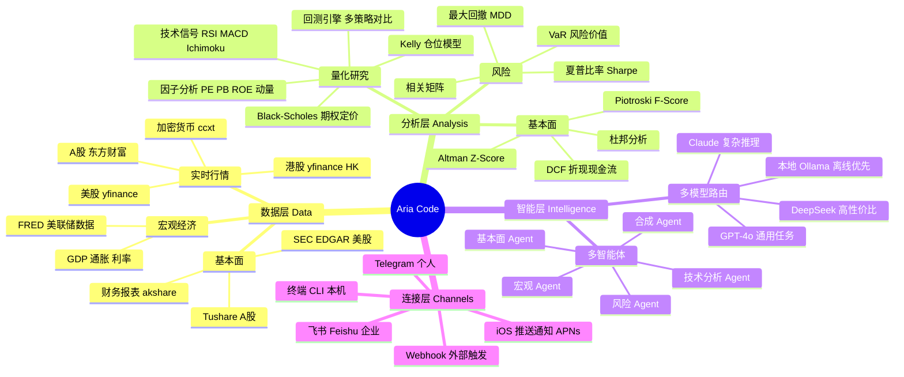

<p align="center">
  <a href="./README.md"></a>
  
</p>

<p align="center">
  
  
  
  
  
</p>

<h1 align="center">🤖 Aria Code</h1>

<p align="center">
  <b>AI-powered financial terminal for the command line</b><br>
  <sub>Runs fully offline · Connects to Feishu & Telegram · Built for investors & quant researchers</sub>
</p>

<p align="center">
  <a href="#-quick-start">Quick Start</a> ·
  <a href="#-feishu-飞书-integration">Feishu</a> ·
  <a href="#-telegram-integration">Telegram</a> ·
  <a href="#-commands">Commands</a> ·
  <a href="#-architecture">Architecture</a> ·
  <a href="./CONTRIBUTING.md">Contributing</a>
</p>

---

## What is Aria Code?

Aria Code is a terminal-first AI financial agent. Ask it anything about stocks, quantitative research, portfolios, or code — it responds with data, formulas, and charts right in your terminal.

```
$ aria-code -p "帮我分析茅台 600519 的基本面"

  贵州茅台 (600519.SS)  ── 基本面速览
  ─────────────────────────────────────────
  市盈率 (TTM)    28.4x   ↓ vs 行业均值 35x
  市净率           9.2x
  ROE              31.8%   连续 10 年 > 25%
  净利率           52.3%   白酒行业最高
  自由现金流       ¥380 亿  同比 +18%
  护城河评分       ★★★★★  品牌+渠道双重壁垒

  DCF 估值区间:  ¥1,680 — ¥1,920 / 股
  当前价格:       ¥1,743  (处于合理区间)

  2.1s · 东方财富实时数据 · qwen2.5-coder:7b
```

---

## 🧠 Thinking Framework

Aria Code follows a **4-layer reasoning pipeline** for every financial query:



---

## ✨ Features

| 能力 | 说明 |
|------|------|
| 🦙 **100% 本地离线** | Ollama 驱动，无需 API Key，数据不出本机 |
| 📊 **金融智能体** | DCF / WACC / PE / 夏普比率 / Kelly / Black-Scholes 等 30+ 内置公式 |
| 📈 **实时行情** | A股(东方财富) · 美股(yfinance) · 港股 · 加密货币(ccxt) |
| 🔍 **量化研究** | `/backtest` `/signal` `/kelly` `/factor` `/portfolio` `/screen` |
| 🤖 **多模型自动路由** | Ollama → Claude → OpenAI → DeepSeek → Gemini → DashScope |
| 🔌 **MCP 协议** | 接入任何 [Model Context Protocol](https://modelcontextprotocol.io) 服务 |
| 💬 **飞书 / Telegram** | 随时随地在聊天软件里问 Aria |
| 📱 **iOS 推送** | APNs 实时推送价格预警 |
| 🌍 **中英双语** | 中文提问→中文回答，英文提问→英文回答 |
| 🏠 **不动产分析** | 70城房价 / REIT / 租金 / 物业估值 / 区位评分 |

---

## 🚀 Quick Start

### Option 1: One-line install (macOS / Linux)

```bash
git clone https://github.com/Cinsoul/Aria-Code.git
cd aria-code
./install.sh
```

安装后把 `~/.local/bin` 加到 PATH：

```bash
echo 'export PATH="$HOME/.local/bin:$PATH"' >> ~/.zshrc && source ~/.zshrc
```

### Option 2: Run directly

```bash
git clone https://github.com/Cinsoul/Aria-Code.git
cd aria-code
python3 -m venv .venv && source .venv/bin/activate
pip install -r requirements.txt
python3 aria_cli.py
```

### Step 1: Install Ollama (local LLM — offline, free)

```bash
# macOS / Linux
curl -fsSL https://ollama.ai/install.sh | sh

# Pull a model (choose one)
ollama pull qwen2.5-coder:7b    # 推荐 — 速度快，中文好 (~4.7GB)
ollama pull deepseek-r1:7b      # 强推理，适合复杂量化任务
ollama pull llama3.2:3b         # 最轻量 (~2GB)
```

运行 `aria-code` 即可，自动检测 Ollama。

### Step 2: Cloud API (optional)

```bash
cp .env.example .env
# 编辑 .env，填入任意云端 Key（全部可选）:
# ANTHROPIC_API_KEY=sk-ant-...
# OPENAI_API_KEY=sk-...
# DEEPSEEK_API_KEY=sk-...
```

---

## 💬 Feishu 飞书 Integration

把 Aria 接入飞书，在任意群/私聊里问金融问题。

### 架构总览

```
你的飞书消息
     │
     ▼
飞书服务器
     │
  ┌──┴─────────────────────────────┐
  │  方案A: 中继模式(推荐，5分钟)   │  方案B: 自建应用(20分钟)
  │  Aria Relay Server              │  飞书开放平台 App
  │  wss://relay.aria.ai            │  需要公网IP/内网穿透
  └──┬─────────────────────────────┘
     │
     ▼
aria_relay_client.py (本机)
     │
     ▼
aria_cli.py → LLM → 返回结果
```

---

### 方案 A：中继模式（推荐，无需公网 IP）

> 最简单的方式。Aria 官方中继服务器负责转发飞书消息，你只需在本机运行客户端。

**第 1 步：生成你的客户端 ID**

```bash
python3 setup_wizard.py
# 选择「飞书中继模式」，会输出:
# ✅ 你的 Client ID: ARIA-xxxxxxxx-xxxx
```

**第 2 步：在飞书中绑定**

向飞书 **Aria Bot** 发送（群聊或私聊均可）：

```
/bind ARIA-xxxxxxxx-xxxx
```

Bot 回复「绑定成功」后，你的本机与飞书建立了专属通道。

**第 3 步：配置本机环境**

```bash
cp .env.daemon.template ~/.aria/.env
# 编辑 ~/.aria/.env，填入:
```

```env
ARIA_RELAY_URL=wss://relay.aria.ai
ARIA_RELAY_CLIENT_ID=ARIA-xxxxxxxx-xxxx   # 第1步生成的ID
ARIA_RELAY_MODE=relay
ARIA_CODE_DIR=~/aria-code                  # 本机 aria-code 路径
ARIA_API_BASE=http://localhost:8000
```

**第 4 步：启动**

```bash
# 前台运行（调试用）
python3 aria_relay_client.py

# 后台常驻（推荐）
python3 aria_daemon.py start
```

现在在飞书任意群@你的 Bot，或私聊发送问题即可：

```
@Aria 帮我看看 NVDA 今天怎么样？
@Aria /screen PE<15 ROE>20 市值>500亿
```

---

### 方案 B：自建飞书应用（双向交互，完整功能）

> 适合企业/团队部署，支持斜杠命令、主动推送、按钮交互。

**第 1 步：创建飞书自建应用**

1. 打开 [飞书开放平台](https://open.feishu.cn/app) → 「创建自建应用」
2. 进入「凭证与基本信息」→ 复制 **App ID** 和 **App Secret**
3. 进入「事件订阅」→ 设置请求地址：`https://你的域名/api/v1/feishu/webhook`
4. 订阅事件：`im.message.receive_v1`（接收消息）
5. 进入「权限管理」→ 开启：`im:message`（读写消息）
6. 发布应用

**第 2 步：内网穿透（无公网IP时）**

```bash
# 使用 ngrok（免费）
ngrok http 8000
# 将 https://xxx.ngrok.io 填入飞书事件订阅地址
```

**第 3 步：配置**

```bash
cp .env.daemon.template ~/.aria/.env
```

```env
# 飞书应用凭证
FEISHU_APP_ID=cli_xxxxxxxxxxxxxxxxx
FEISHU_APP_SECRET=xxxxxxxxxxxxxxxxxxxxxxxxxxxxxxxx
FEISHU_ENCRYPT_KEY=              # 可选，生产环境建议开启
FEISHU_DEFAULT_CHAT_ID=oc_xxx    # 默认推送群的 Chat ID

# 运行模式
ARIA_RELAY_MODE=own_app
ARIA_CODE_DIR=~/aria-code
ARIA_API_BASE=http://localhost:8000
```

**第 4 步：启动**

```bash
python3 aria_daemon.py start
# 或直接启动飞书 Bot
python3 aria_feishu_bot.py
```

**飞书 Bot 支持的命令**

```
/price 600519          → 茅台实时行情
/brief AAPL            → AI 基本面简报
/screen PE<20 ROE>15   → 选股筛选
/backtest momentum SPY → 策略回测
/portfolio 茅台 宁德 腾讯 → 组合分析
/help                  → 显示所有命令
```

---

## 📱 Telegram Integration

在 Telegram 里随时随地问 Aria，支持私聊和群组。

### 架构图

```
Telegram App
     │  你的消息
     ▼
Telegram Bot API (api.telegram.org)
     │  轮询 / Webhook
     ▼
aria_telegram_bot.py (本机)
     │
     ▼
aria_cli.py → LLM → 返回结果
     │
     ▼
Telegram Bot API → 你的手机
```

---

### Step 1：创建 Telegram Bot

1. 在 Telegram 搜索 **@BotFather**，发送 `/newbot`
2. 为 Bot 起名（如 `Aria Financial Bot`）
3. 设置用户名（必须以 `bot` 结尾，如 `aria_finance_bot`）
4. BotFather 返回你的 **Bot Token**：`1234567890:ABCDEFGxxxxxxxxxxxxxx`

### Step 2：获取你的 Chat ID

方法一（推荐）：向 **@userinfobot** 发消息，它会直接返回你的 Chat ID。

方法二：向你的 Bot 发任意消息，然后访问：
```
https://api.telegram.org/bot<YOUR_TOKEN>/getUpdates
```
在返回 JSON 里找 `"chat":{"id": 123456789}` 即为你的 Chat ID。

### Step 3：配置

```bash
cp .env.daemon.template ~/.aria/.env
# 编辑 ~/.aria/.env：
```

```env
# Telegram Bot 配置
TELEGRAM_BOT_TOKEN=1234567890:ABCDEFGxxxxxxxxxxxxxx
TELEGRAM_ALLOWED_IDS=123456789          # 你的 Chat ID（逗号分隔多个）

# 如果要允许群组，把群组 ID 也加进来（群组 ID 是负数）
# TELEGRAM_ALLOWED_IDS=123456789,-987654321

ARIA_CODE_DIR=~/aria-code
ARIA_API_BASE=http://localhost:8000
```

> ⚠️ **安全提示**：`TELEGRAM_ALLOWED_IDS` 只允许指定 ID 的用户使用 Bot。不填则任何人都可以使用，**强烈建议填写**。

### Step 4：启动

```bash
# 前台运行（调试）
python3 aria_telegram_bot.py

# 后台常驻（推荐）
python3 aria_daemon.py start

# 开机自启（macOS）
python3 aria_daemon.py install   # 注册 launchd 服务
```

### Step 5：开始使用

在 Telegram 私聊你的 Bot：

```
/start                     → 欢迎 + 帮助
/price AAPL                → 苹果实时报价
/price 600519              → 茅台 A股报价

直接发送自然语言:
"帮我分析 NVDA 的技术面"
"什么是夏普比率？给我公式"
"茅台最新财报关键数据"
"帮我做一个 AAPL MSFT GOOGL 的组合回测"
```

---

### 连接状态速查

```bash
# 检查所有服务状态
python3 aria_daemon.py status

# 输出示例:
# ✅ Telegram Bot    在线  (最后消息: 3分钟前)
# ✅ Feishu Relay    在线  (已绑定 2 个群)
# ✅ Ollama          在线  qwen2.5-coder:7b
# ✅ Market Data     在线  东方财富 / yfinance
# ⚠️ APNs            未配置  (iOS推送不可用)
```

---

## ⚡ Commands Reference

### Market & Quotes

```bash
/quote AAPL MSFT TSLA          # 实时报价（多标的）
/quote 000001 600519 300750    # A股报价
/quote BTC/USDT ETH/USDT       # 加密货币
/news AAPL                     # 最新新闻
/regime                        # 市场状态（牛/熊/震荡）
```

### Quantitative Research

```bash
/signal TSLA                   # 技术信号（RSI / MACD / 布林带）
/backtest momentum SPY 2023-01-01 2024-12-31
/backtest ml 600519 300750 NVDA     # ML 信号回测（三策略对比）
/kelly AAPL 0.6 2.0            # Kelly 公式 — 仓位建议
/factor PE PB ROE              # 多因子分析
/screen PE<15 ROE>20 市值>500亿  # 选股筛选
/portfolio AAPL MSFT GOOGL     # 投资组合优化
/dcf                           # DCF 估值模板
```

### Analysis

```bash
/brief AAPL                    # AI 一分钟基本面简报
/compare BABA JD               # 公司对比（财务 + 估值）
/macro                         # 宏观经济仪表盘
/sector tech                   # 板块分析
/realty 上海 浦东               # 不动产分析
```

### System

```bash
/model                         # 查看 / 切换 LLM
/provider                      # LLM 提供商状态
/status                        # 系统健康检查
/tools                         # 已启用工具列表
/export                        # 导出对话
/clear                         # 清除历史
```

---

## 🏗️ Architecture

### System Overview

```
┌─────────────────────────────────────────────────────────────┐
│                        Aria Code                            │
│                                                             │
│  ┌──────────┐  ┌──────────┐  ┌──────────┐  ┌──────────┐  │
│  │  终端CLI  │  │  飞书Bot  │  │ Telegram │  │  Webhook │  │
│  └────┬─────┘  └────┬─────┘  └────┬─────┘  └────┬─────┘  │
│       └──────────────┴──────────────┴──────────────┘        │
│                              │                               │
│                    ┌─────────▼──────────┐                   │
│                    │   aria_daemon.py    │                   │
│                    │  (消息路由 + 调度)   │                   │
│                    └─────────┬──────────┘                   │
│                              │                               │
│              ┌───────────────┼───────────────┐              │
│              │               │               │              │
│    ┌─────────▼──┐  ┌─────────▼──┐  ┌────────▼──┐          │
│    │   LLM路由   │  │  工具执行   │  │  数据层   │          │
│    │ Ollama/API │  │  bash/file  │  │ 行情/财报 │          │
│    └────────────┘  └────────────┘  └───────────┘          │
└─────────────────────────────────────────────────────────────┘
```

### File Structure

```
aria-code/
├── aria_cli.py               # 主 CLI + REPL 入口
├── aria_daemon.py            # 后台守护进程 + 调度
├── aria_feishu_bot.py        # 飞书 Bot（自建应用模式）
├── aria_relay_client.py      # 飞书中继客户端
├── aria_relay_server.py      # 飞书中继服务器（可自建）
├── aria_telegram_bot.py      # Telegram Bot
├── market_data_client.py     # 统一行情接口
├── local_finance_tools.py    # 内置金融计算器
├── financial_agents.py       # 多智能体编排
│
├── providers/llm/            # LLM 适配层
│   ├── anthropic.py          # Claude
│   ├── ollama.py             # Ollama（本地）
│   ├── openai_compat.py      # OpenAI + 兼容 API
│   └── registry.py           # 自动检测与路由
│
├── agents/
│   ├── financial/            # 基本面/技术/宏观/风险/合成 Agent
│   └── realty/               # 不动产 9 个专项 Agent
│
├── brokers/                  # 券商接入
│   ├── cn/                   # 富途/长桥/老虎/东方财富/中信
│   └── intl/                 # IBKR/Alpaca/Webull
│
├── datasources/sources/      # 数据源适配器
│   ├── yfinance_source.py
│   ├── akshare_source.py
│   ├── fred_source.py        # 美联储宏观数据
│   └── edgar_source.py       # SEC EDGAR
│
├── apps/cli/commands/        # 斜杠命令模块（已拆分）
│   ├── backtest_cmds.py
│   ├── market_cmds.py
│   ├── portfolio_cmds.py
│   └── broker_cmds.py
│
└── config/                   # 配置模板
    ├── providers.example.yaml
    ├── mcp_servers.example.json
    └── datasources.example.yaml
```

---

## 📡 Market Data Sources

| 数据源 | 覆盖范围 | 是否需要 Key |
|--------|----------|-------------|
| **东方财富 Eastmoney** | A股实时报价、北向资金、涨跌停 | 无（免费） |
| **akshare** | A股历史、财务报表、行业数据 | 无（免费） |
| **yfinance** | 美股、港股、ETF、外汇 | 无（免费） |
| **ccxt** | 100+ 加密货币交易所 | 无（免费档） |
| **FRED** | 美联储宏观数据、GDP、CPI | 可选（免费注册） |
| **SEC EDGAR** | 美股 10-K/10-Q 财报 | 无（免费） |
| Tushare | A股历史 + 财务（更完整） | 可选（免费 token） |
| Finnhub | 美股实时 + 盈利数据 | 可选（免费档） |
| Alpha Vantage | 美股历史 + 基本面 | 可选（免费档） |

---

## 🔌 MCP Integration

接入任何 [Model Context Protocol](https://modelcontextprotocol.io) 服务器：

```bash
cp config/mcp_servers.example.json config/mcp_servers.json
```

```json
{
  "servers": [
    {
      "name": "filesystem",
      "command": "npx",
      "args": ["-y", "@modelcontextprotocol/server-filesystem", "/your/project"]
    },
    {
      "name": "brave-search",
      "command": "npx",
      "args": ["-y", "@modelcontextprotocol/server-brave-search"],
      "env": { "BRAVE_API_KEY": "your-key" }
    }
  ]
}
```

在 Aria 内使用：

```bash
/mcp list          # 查看已连接的 MCP 服务
/mcp status        # 服务状态
```

---

## ⚙️ Configuration

Aria Code 的配置存放在 `~/.arthera/config.json`。也可以在项目根目录放 `.ariarc` 文件实现项目级配置：

```json
{
  "model": "ollama/qwen2.5-coder:7b",
  "market": "cn",
  "default_symbols": ["600519", "300750", "0700.HK", "NVDA"],
  "tools": ["read_file", "write_file", "bash", "web_search"],
  "commands": {
    "/morning": "生成今日 A股早盘简报，重点关注 {default_symbols}"
  }
}
```

### LLM Provider Priority

Aria 按优先级自动选择可用的 LLM：

```
本地 Ollama  →  Anthropic Claude  →  OpenAI  →  DeepSeek  →  Gemini  →  DashScope
（离线优先）      （最强推理）         （通用）     （高性价比）   （多模态）  （中文优化）
```

强制使用本地模式：`ARIA_MODEL=ollama/qwen2.5-coder:7b`

---

## 🛠️ Requirements

- Python **3.10+**
- [Ollama](https://ollama.ai)（本地模式，强烈推荐）
- RAM: 4GB+（7B 模型推荐 8GB+）
- 系统: macOS · Linux · Windows (WSL2)

```bash
# 安装所有依赖
pip install -r requirements.txt
```

核心依赖：`rich` · `prompt_toolkit` · `yfinance` · `akshare` · `ccxt` · `pandas` · `numpy`

---

## 🤝 Contributing

欢迎贡献！请查看 [CONTRIBUTING.md](./CONTRIBUTING.md)。

```bash
git clone https://github.com/Cinsoul/Aria-Code.git
cd aria-code
python3 -m venv .venv && source .venv/bin/activate
pip install -r requirements.txt
pytest tests/ -v
```

Issues、PR、中文讨论均欢迎。

---

## 🔗 Links

- 🌐 Website: [arthera.finance](https://arthera.finance)
- 📦 Full platform: [github.com/Cinsoul/Arthera](https://github.com/Cinsoul/Arthera)
- 🐛 Issues: [github.com/Cinsoul/Aria-Code/issues](https://github.com/Cinsoul/Aria-Code/issues)
- 💬 Discussions: [github.com/Cinsoul/Aria-Code/discussions](https://github.com/Cinsoul/Aria-Code/discussions)

---

## Relation to Arthera

Aria Code 是 [Arthera](https://arthera.finance) 量化投资平台的开源 CLI 组件。完整 Arthera 平台包含 Web 仪表盘、桌面终端、iOS App 和机构量化引擎。

Aria Code **可完全独立使用** — 不依赖 Arthera 后端。所有金融计算均在本机完成。云端功能（实时 A 股数据、ML 预测）可选，连接自建后端或 Arthera 云服务。

---

<p align="center">
  MIT © 2025 Arthera Team — <a href="./LICENSE">License</a>
</p>
